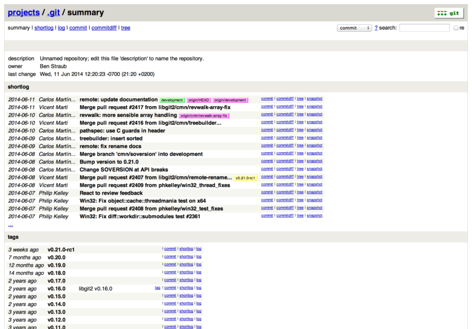

### GitWeb

Now that you have basic read/write and read-only access to your project,
you may want to set up a simple web-based visualizer. Git comes with a
CGI script called GitWeb that is sometimes used for this.



Figure 1. The GitWeb web-based user interface

If you want to check out what GitWeb would look like for your project,
Git comes with a command to fire up a temporary instance if you have a
lightweight web server on your system like `lighttpd` or `webrick`. On
Linux machines, `lighttpd` is often installed, so you may be able to get
it to run by typing `git instaweb` in your project directory. If you’re
running macOS, Leopard comes preinstalled with Ruby, so `webrick` may be
your best bet. To start `instaweb` with a non-lighttpd handler, you can
run it with the `--httpd` option.

```shell
$ git instaweb --httpd=webrick
[2009-02-21 10:02:21] INFO  WEBrick 1.3.1
[2009-02-21 10:02:21] INFO  ruby 1.8.6 (2008-03-03) [universal-darwin9.0]
```

That starts up an HTTPD server on port 1234 and then automatically
starts a web browser that opens on that page. It’s pretty easy on your
part. When you’re done and want to shut down the server, you can run the
same command with the `--stop` option:

```shell
$ git instaweb --httpd=webrick --stop
```

If you want to run the web interface on a server all the time for your
team or for an open source project you’re hosting, you’ll need to set up
the CGI script to be served by your normal web server. Some Linux
distributions have a `gitweb` package that you may be able to install
via `apt` or `dnf`, so you may want to try that first. We’ll walk
through installing GitWeb manually very quickly. First, you need to get
the Git source code, which GitWeb comes with, and generate the custom
CGI script:

```shell
$ git clone https://git.kernel.org/pub/scm/git/git.git
$ cd git/
$ make GITWEB_PROJECTROOT="/srv/git" prefix=/usr gitweb
    SUBDIR gitweb
    SUBDIR ../
make[2]: `GIT-VERSION-FILE' is up to date.
    GEN gitweb.cgi
    GEN static/gitweb.js
$ sudo cp -Rf gitweb /var/www/
```

Notice that you have to tell the command where to find your Git
repositories with the `GITWEB_PROJECTROOT` variable. Now, you need to
make Apache use CGI for that script, for which you can add a
VirtualHost:

```shell
<VirtualHost *:80>
    ServerName gitserver
    DocumentRoot /var/www/gitweb
    <Directory /var/www/gitweb>
        Options +ExecCGI +FollowSymLinks +SymLinksIfOwnerMatch
        AllowOverride All
        order allow,deny
        Allow from all
        AddHandler cgi-script cgi
        DirectoryIndex gitweb.cgi
    </Directory>
</VirtualHost>
```

Again, GitWeb can be served with any CGI or Perl capable web server; if
you prefer to use something else, it shouldn’t be difficult to set up.
At this point, you should be able to visit
[`http://gitserver/`](http://gitserver/) to view your repositories
online.

Last updated 2024-03-09 10:34:08 +0800
