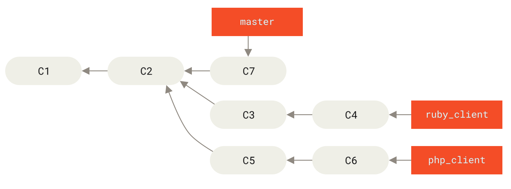
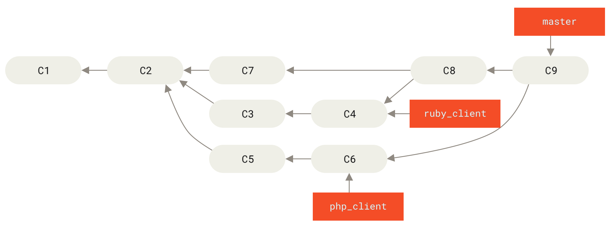
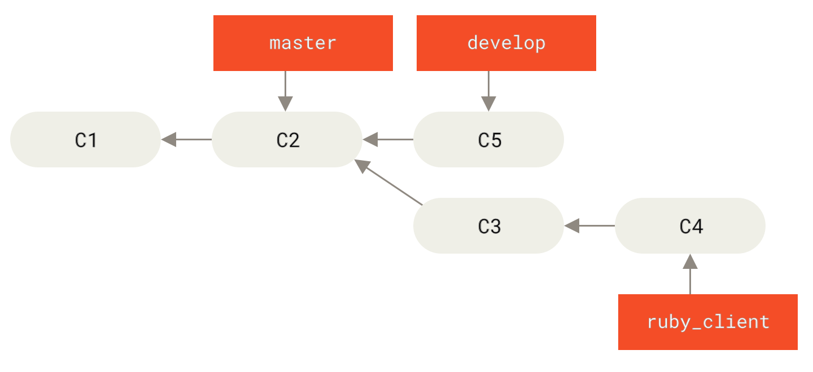
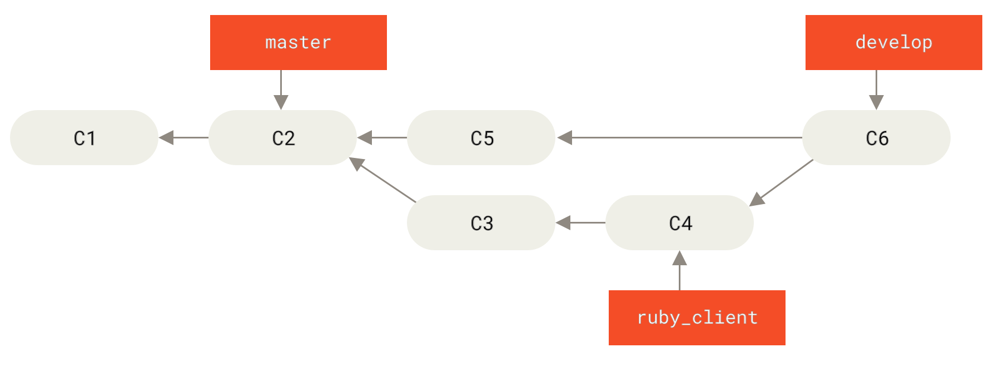
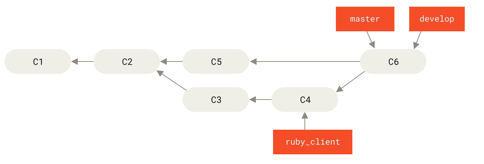

### Maintaining a Project

In addition to knowing how to contribute effectively to a project,
you’ll likely need to know how to maintain one. This can consist of
accepting and applying patches generated via `format-patch` and emailed
to you, or integrating changes in remote branches for repositories
you’ve added as remotes to your project. Whether you maintain a
canonical repository or want to help by verifying or approving patches,
you need to know how to accept work in a way that is clearest for other
contributors and sustainable by you over the long run.

#### Working in Topic Branches

When you’re thinking of integrating new work, it’s generally a good idea
to try it out in a *topic branch* — a temporary branch specifically made
to try out that new work. This way, it’s easy to tweak a patch
individually and leave it if it’s not working until you have time to
come back to it. If you create a simple branch name based on the theme
of the work you’re going to try, such as `ruby_client` or something
similarly descriptive, you can easily remember it if you have to abandon
it for a while and come back later. The maintainer of the Git project
tends to namespace these branches as well — such as `sc/ruby_client`,
where `sc` is short for the person who contributed the work. As you’ll
remember, you can create the branch based off your `master` branch like
this:

```shell
$ git branch sc/ruby_client master
```

Or, if you want to also switch to it immediately, you can use the
`checkout -b` option:

```shell
$ git checkout -b sc/ruby_client master
```

Now you’re ready to add the contributed work that you received into this
topic branch and determine if you want to merge it into your longer-term
branches.

#### Applying Patches from Email

If you receive a patch over email that you need to integrate into your
project, you need to apply the patch in your topic branch to evaluate
it. There are two ways to apply an emailed patch: with `git apply` or
with `git am`.

##### Applying a Patch with `apply`

If you received the patch from someone who generated it with `git diff`
or some variation of the Unix `diff` command (which is not recommended;
see the next section), you can apply it with the `git apply` command.
Assuming you saved the patch at `/tmp/patch-ruby-client.patch`, you can
apply the patch like this:

```shell
$ git apply /tmp/patch-ruby-client.patch
```

This modifies the files in your working directory. It’s almost identical
to running a `patch -p1` command to apply the patch, although it’s more
paranoid and accepts fewer fuzzy matches than patch. It also handles
file adds, deletes, and renames if they’re described in the `git diff`
format, which `patch` won’t do. Finally, `git apply` is an “apply all or
abort all” model where either everything is applied or nothing is,
whereas `patch` can partially apply patchfiles, leaving your working
directory in a weird state. `git apply` is overall much more
conservative than `patch`. It won’t create a commit for you — after
running it, you must stage and commit the changes introduced manually.

You can also use `git apply` to see if a patch applies cleanly before
you try actually applying it — you can run `git apply --check` with the
patch:

```shell
$ git apply --check 0001-see-if-this-helps-the-gem.patch
error: patch failed: ticgit.gemspec:1
error: ticgit.gemspec: patch does not apply
```

If there is no output, then the patch should apply cleanly. This command
also exits with a non-zero status if the check fails, so you can use it
in scripts if you want.

##### Applying a Patch with `am`

If the contributor is a Git user and was good enough to use the
`format-patch` command to generate their patch, then your job is easier
because the patch contains author information and a commit message for
you. If you can, encourage your contributors to use `format-patch`
instead of `diff` to generate patches for you. You should only have to
use `git apply` for legacy patches and things like that.

To apply a patch generated by `format-patch`, you use `git am` (the
command is named `am` as it is used to "apply a series of patches from a
mailbox"). Technically, `git am` is built to read an mbox file, which is
a simple, plain-text format for storing one or more email messages in
one text file. It looks something like this:

```shell
From 330090432754092d704da8e76ca5c05c198e71a8 Mon Sep 17 00:00:00 2001
From: Jessica Smith <jessica@example.com>
Date: Sun, 6 Apr 2008 10:17:23 -0700
Subject: [PATCH 1/2] Add limit to log function

Limit log functionality to the first 20
```

This is the beginning of the output of the `git format-patch` command
that you saw in the previous section; it also represents a valid mbox
email format. If someone has emailed you the patch properly using
`git send-email`, and you download that into an mbox format, then you
can point `git am` to that mbox file, and it will start applying all the
patches it sees. If you run a mail client that can save several emails
out in mbox format, you can save entire patch series into a file and
then use `git am` to apply them one at a time.

However, if someone uploaded a patch file generated via
`git format-patch` to a ticketing system or something similar, you can
save the file locally and then pass that file saved on your disk to
`git am` to apply it:

```shell
$ git am 0001-limit-log-function.patch
Applying: Add limit to log function
```

You can see that it applied cleanly and automatically created the new
commit for you. The author information is taken from the email’s `From`
and `Date` headers, and the message of the commit is taken from the
`Subject` and body (before the patch) of the email. For example, if this
patch was applied from the mbox example above, the commit generated
would look something like this:

```shell
$ git log --pretty=fuller -1
commit 6c5e70b984a60b3cecd395edd5b48a7575bf58e0
Author:     Jessica Smith <jessica@example.com>
AuthorDate: Sun Apr 6 10:17:23 2008 -0700
Commit:     Scott Chacon <schacon@gmail.com>
CommitDate: Thu Apr 9 09:19:06 2009 -0700

   Add limit to log function

   Limit log functionality to the first 20
```

The `Commit` information indicates the person who applied the patch and
the time it was applied. The `Author` information is the individual who
originally created the patch and when it was originally created.

But it’s possible that the patch won’t apply cleanly. Perhaps your main
branch has diverged too far from the branch the patch was built from, or
the patch depends on another patch you haven’t applied yet. In that
case, the `git am` process will fail and ask you what you want to do:

```shell
$ git am 0001-see-if-this-helps-the-gem.patch
Applying: See if this helps the gem
error: patch failed: ticgit.gemspec:1
error: ticgit.gemspec: patch does not apply
Patch failed at 0001.
When you have resolved this problem run "git am --resolved".
If you would prefer to skip this patch, instead run "git am --skip".
To restore the original branch and stop patching run "git am --abort".
```

This command puts conflict markers in any files it has issues with, much
like a conflicted merge or rebase operation. You solve this issue much
the same way — edit the file to resolve the conflict, stage the new
file, and then run `git am --resolved` to continue to the next patch:

```shell
$ (fix the file)
$ git add ticgit.gemspec
$ git am --resolved
Applying: See if this helps the gem
```

If you want Git to try a bit more intelligently to resolve the conflict,
you can pass a `-3` option to it, which makes Git attempt a three-way
merge. This option isn’t on by default because it doesn’t work if the
commit the patch says it was based on isn’t in your repository. If you
do have that commit — if the patch was based on a public commit — then
the `-3` option is generally much smarter about applying a conflicting
patch:

```shell
$ git am -3 0001-see-if-this-helps-the-gem.patch
Applying: See if this helps the gem
error: patch failed: ticgit.gemspec:1
error: ticgit.gemspec: patch does not apply
Using index info to reconstruct a base tree...
Falling back to patching base and 3-way merge...
No changes -- Patch already applied.
```

In this case, without the `-3` option the patch would have been
considered as a conflict. Since the `-3` option was used the patch
applied cleanly.

If you’re applying a number of patches from an mbox, you can also run
the `am` command in interactive mode, which stops at each patch it finds
and asks if you want to apply it:

```shell
$ git am -3 -i mbox
Commit Body is:
--------------------------
See if this helps the gem
--------------------------
Apply? [y]es/[n]o/[e]dit/[v]iew patch/[a]ccept all
```

This is nice if you have a number of patches saved, because you can view
the patch first if you don’t remember what it is, or not apply the patch
if you’ve already done so.

When all the patches for your topic are applied and committed into your
branch, you can choose whether and how to integrate them into a
longer-running branch.

#### Checking Out Remote Branches

If your contribution came from a Git user who set up their own
repository, pushed a number of changes into it, and then sent you the
URL to the repository and the name of the remote branch the changes are
in, you can add them as a remote and do merges locally.

For instance, if Jessica sends you an email saying that she has a great
new feature in the `ruby-client` branch of her repository, you can test
it by adding the remote and checking out that branch locally:

```shell
$ git remote add jessica https://github.com/jessica/myproject.git
$ git fetch jessica
$ git checkout -b rubyclient jessica/ruby-client
```

If she emails you again later with another branch containing another
great feature, you could directly `fetch` and `checkout` because you
already have the remote setup.

This is most useful if you’re working with a person consistently. If
someone only has a single patch to contribute once in a while, then
accepting it over email may be less time consuming than requiring
everyone to run their own server and having to continually add and
remove remotes to get a few patches. You’re also unlikely to want to
have hundreds of remotes, each for someone who contributes only a patch
or two. However, scripts and hosted services may make this easier — it
depends largely on how you develop and how your contributors develop.

The other advantage of this approach is that you get the history of the
commits as well. Although you may have legitimate merge issues, you know
where in your history their work is based; a proper three-way merge is
the default rather than having to supply a `-3` and hope the patch was
generated off a public commit to which you have access.

If you aren’t working with a person consistently but still want to pull
from them in this way, you can provide the URL of the remote repository
to the `git pull` command. This does a one-time pull and doesn’t save
the URL as a remote reference:

```shell
$ git pull https://github.com/onetimeguy/project
From https://github.com/onetimeguy/project
 * branch            HEAD       -> FETCH_HEAD
Merge made by the 'recursive' strategy.
```

#### Determining What Is Introduced

Now you have a topic branch that contains contributed work. At this
point, you can determine what you’d like to do with it. This section
revisits a couple of commands so you can see how you can use them to
review exactly what you’ll be introducing if you merge this into your
main branch.

It’s often helpful to get a review of all the commits that are in this
branch but that aren’t in your `master` branch. You can exclude commits
in the `master` branch by adding the `--not` option before the branch
name. This does the same thing as the `master..contrib` format that we
used earlier. For example, if your contributor sends you two patches and
you create a branch called `contrib` and applied those patches there,
you can run this:

```shell
$ git log contrib --not master
commit 5b6235bd297351589efc4d73316f0a68d484f118
Author: Scott Chacon <schacon@gmail.com>
Date:   Fri Oct 24 09:53:59 2008 -0700

    See if this helps the gem

commit 7482e0d16d04bea79d0dba8988cc78df655f16a0
Author: Scott Chacon <schacon@gmail.com>
Date:   Mon Oct 22 19:38:36 2008 -0700

    Update gemspec to hopefully work better
```

To see what changes each commit introduces, remember that you can pass
the `-p` option to `git log` and it will append the diff introduced to
each commit.

To see a full diff of what would happen if you were to merge this topic
branch with another branch, you may have to use a weird trick to get the
correct results. You may think to run this:

```shell
$ git diff master
```

This command gives you a diff, but it may be misleading. If your
`master` branch has moved forward since you created the topic branch
from it, then you’ll get seemingly strange results. This happens because
Git directly compares the snapshots of the last commit of the topic
branch you’re on and the snapshot of the last commit on the `master`
branch. For example, if you’ve added a line in a file on the `master`
branch, a direct comparison of the snapshots will look like the topic
branch is going to remove that line.

If `master` is a direct ancestor of your topic branch, this isn’t a
problem; but if the two histories have diverged, the diff will look like
you’re adding all the new stuff in your topic branch and removing
everything unique to the `master` branch.

What you really want to see are the changes added to the topic
branch — the work you’ll introduce if you merge this branch with
`master`. You do that by having Git compare the last commit on your
topic branch with the first common ancestor it has with the `master`
branch.

Technically, you can do that by explicitly figuring out the common
ancestor and then running your diff on it:

```shell
$ git merge-base contrib master
36c7dba2c95e6bbb78dfa822519ecfec6e1ca649
$ git diff 36c7db
```

or, more concisely:

```shell
$ git diff $(git merge-base contrib master)
```

However, neither of those is particularly convenient, so Git provides
another shorthand for doing the same thing: the triple-dot syntax. In
the context of the `git diff` command, you can put three periods after
another branch to do a `diff` between the last commit of the branch
you’re on and its common ancestor with another branch:

```shell
$ git diff master...contrib
```

This command shows you only the work your current topic branch has
introduced since its common ancestor with `master`. That is a very
useful syntax to remember.

#### Integrating Contributed Work

When all the work in your topic branch is ready to be integrated into a
more mainline branch, the question is how to do it. Furthermore, what
overall workflow do you want to use to maintain your project? You have a
number of choices, so we’ll cover a few of them.

##### Merging Workflows

One basic workflow is to simply merge all that work directly into your
`master` branch. In this scenario, you have a `master` branch that
contains basically stable code. When you have work in a topic branch
that you think you’ve completed, or work that someone else has
contributed and you’ve verified, you merge it into your master branch,
delete that just-merged topic branch, and repeat.

For instance, if we have a repository with work in two branches named
`ruby_client` and `php_client` that looks like [History with several
topic branches](#merwf_a), and we merge `ruby_client` followed by
`php_client`, your history will end up looking like [After a topic
branch merge](#merwf_b).



Figure 1. History with several topic branches



Figure 2. After a topic branch merge

That is probably the simplest workflow, but it can possibly be
problematic if you’re dealing with larger or more stable projects where
you want to be really careful about what you introduce.

If you have a more important project, you might want to use a two-phase
merge cycle. In this scenario, you have two long-running branches,
`master` and `develop`, in which you determine that `master` is updated
only when a very stable release is cut and all new code is integrated
into the `develop` branch. You regularly push both of these branches to
the public repository. Each time you have a new topic branch to merge in
([Before a topic branch merge](#merwf_c)), you merge it into `develop`
([After a topic branch merge](#merwf_d)); then, when you tag a release,
you fast-forward `master` to wherever the now-stable `develop` branch is
([After a project release](#merwf_e)).



Figure 3. Before a topic branch merge



Figure 4. After a topic branch merge



Figure 5. After a project release

This way, when people clone your project’s repository, they can either
check out `master` to build the latest stable version and keep up to
date on that easily, or they can check out `develop`, which is the more
cutting-edge content. You can also extend this concept by having an
`integrate` branch where all the work is merged together. Then, when the
codebase on that branch is stable and passes tests, you merge it into a
`develop` branch; and when that has proven itself stable for a while,
you fast-forward your `master` branch.

##### Large-Merging Workflows

The Git project has four long-running branches: `master`, `next`, and
`seen` (formerly 'pu' — proposed updates) for new work, and `maint` for
maintenance backports. When new work is introduced by contributors, it’s
collected into topic branches in the maintainer’s repository in a manner
similar to what we’ve described (see [Managing a complex series of
parallel contributed topic branches](#merwf_f)). At this point, the
topics are evaluated to determine whether they’re safe and ready for
consumption or whether they need more work. If they’re safe, they’re
merged into `next`, and that branch is pushed up so everyone can try the
topics integrated together.


Figure 6. Managing a complex series of parallel contributed topic
branches

If the topics still need work, they’re merged into `seen` instead. When
it’s determined that they’re totally stable, the topics are re-merged
into `master`. The `next` and `seen` branches are then rebuilt from the
`master`. This means `master` almost always moves forward, `next` is
rebased occasionally, and `seen` is rebased even more often:


Figure 7. Merging contributed topic branches into long-term integration
branches

When a topic branch has finally been merged into `master`, it’s removed
from the repository. The Git project also has a `maint` branch that is
forked off from the last release to provide backported patches in case a
maintenance release is required. Thus, when you clone the Git
repository, you have four branches that you can check out to evaluate
the project in different stages of development, depending on how cutting
edge you want to be or how you want to contribute; and the maintainer
has a structured workflow to help them vet new contributions. The Git
project’s workflow is specialized. To clearly understand this you could
check out the [Git Maintainer’s
guide](https://github.com/git/git/blob/master/Documentation/howto/maintain-git.txt).

##### Rebasing and Cherry-Picking Workflows

Other maintainers prefer to rebase or cherry-pick contributed work on
top of their `master` branch, rather than merging it in, to keep a
mostly linear history. When you have work in a topic branch and have
determined that you want to integrate it, you move to that branch and
run the rebase command to rebuild the changes on top of your current
`master` (or `develop`, and so on) branch. If that works well, you can
fast-forward your `master` branch, and you’ll end up with a linear
project history.

The other way to move introduced work from one branch to another is to
cherry-pick it. A cherry-pick in Git is like a rebase for a single
commit. It takes the patch that was introduced in a commit and tries to
reapply it on the branch you’re currently on. This is useful if you have
a number of commits on a topic branch and you want to integrate only one
of them, or if you only have one commit on a topic branch and you’d
prefer to cherry-pick it rather than run rebase. For example, suppose
you have a project that looks like this:


Figure 8. Example history before a cherry-pick

If you want to pull commit `e43a6` into your `master` branch, you can
run:

```shell
$ git cherry-pick e43a6
Finished one cherry-pick.
[master]: created a0a41a9: "More friendly message when locking the index fails."
 3 files changed, 17 insertions(+), 3 deletions(-)
```

This pulls the same change introduced in `e43a6`, but you get a new
commit SHA-1 value, because the date applied is different. Now your
history looks like this:


Figure 9. History after cherry-picking a commit on a topic branch

Now you can remove your topic branch and drop the commits you didn’t
want to pull in.

##### Rerere

If you’re doing lots of merging and rebasing, or you’re maintaining a
long-lived topic branch, Git has a feature called “rerere” that can
help.

Rerere stands for “reuse recorded resolution” — it’s a way of
shortcutting manual conflict resolution. When rerere is enabled, Git
will keep a set of pre- and post-images from successful merges, and if
it notices that there’s a conflict that looks exactly like one you’ve
already fixed, it’ll just use the fix from last time, without bothering
you with it.

This feature comes in two parts: a configuration setting and a command.
The configuration setting is `rerere.enabled`, and it’s handy enough to
put in your global config:

```shell
$ git config --global rerere.enabled true
```

Now, whenever you do a merge that resolves conflicts, the resolution
will be recorded in the cache in case you need it in the future.

If you need to, you can interact with the rerere cache using the
`git rerere` command. When it’s invoked alone, Git checks its database
of resolutions and tries to find a match with any current merge
conflicts and resolve them (although this is done automatically if
`rerere.enabled` is set to `true`). There are also subcommands to see
what will be recorded, to erase specific resolution from the cache, and
to clear the entire cache. We will cover rerere in more detail in
[ch07-git-tools](ch07-git-tools.md#ref_rerere).

#### Tagging Your Releases

When you’ve decided to cut a release, you’ll probably want to assign a
tag so you can re-create that release at any point going forward. You
can create a new tag as discussed in
[ch02-git-basics-chapter](ch02-git-basics-chapter.md#ch02-git-basics-chapter).
If you decide to sign the tag as the maintainer, the tagging may look
something like this:

```shell
$ git tag -s v1.5 -m 'my signed 1.5 tag'
You need a passphrase to unlock the secret key for
user: "Scott Chacon <schacon@gmail.com>"
1024-bit DSA key, ID F721C45A, created 2009-02-09
```

If you do sign your tags, you may have the problem of distributing the
public PGP key used to sign your tags. The maintainer of the Git project
has solved this issue by including their public key as a blob in the
repository and then adding a tag that points directly to that content.
To do this, you can figure out which key you want by running
`gpg --list-keys`:

```shell
$ gpg --list-keys
/Users/schacon/.gnupg/pubring.gpg
---------------------------------
pub   1024D/F721C45A 2009-02-09 [expires: 2010-02-09]
uid                  Scott Chacon <schacon@gmail.com>
sub   2048g/45D02282 2009-02-09 [expires: 2010-02-09]
```

Then, you can directly import the key into the Git database by exporting
it and piping that through `git hash-object`, which writes a new blob
with those contents into Git and gives you back the SHA-1 of the blob:

```shell
$ gpg -a --export F721C45A | git hash-object -w --stdin
659ef797d181633c87ec71ac3f9ba29fe5775b92
```

Now that you have the contents of your key in Git, you can create a tag
that points directly to it by specifying the new SHA-1 value that the
`hash-object` command gave you:

```shell
$ git tag -a maintainer-pgp-pub 659ef797d181633c87ec71ac3f9ba29fe5775b92
```

If you run `git push --tags`, the `maintainer-pgp-pub` tag will be
shared with everyone. If anyone wants to verify a tag, they can directly
import your PGP key by pulling the blob directly out of the database and
importing it into GPG:

```shell
$ git show maintainer-pgp-pub | gpg --import
```

They can use that key to verify all your signed tags. Also, if you
include instructions in the tag message, running `git show <tag>` will
let you give the end user more specific instructions about tag
verification.

#### Generating a Build Number

Because Git doesn’t have monotonically increasing numbers like 'v123' or
the equivalent to go with each commit, if you want to have a
human-readable name to go with a commit, you can run `git describe` on
that commit. In response, Git generates a string consisting of the name
of the most recent tag earlier than that commit, followed by the number
of commits since that tag, followed finally by a partial SHA-1 value of
the commit being described (prefixed with the letter "g" meaning Git):

```shell
$ git describe master
v1.6.2-rc1-20-g8c5b85c
```

This way, you can export a snapshot or build and name it something
understandable to people. In fact, if you build Git from source code
cloned from the Git repository, `git --version` gives you something that
looks like this. If you’re describing a commit that you have directly
tagged, it gives you simply the tag name.

By default, the `git describe` command requires annotated tags (tags
created with the `-a` or `-s` flag); if you want to take advantage of
lightweight (non-annotated) tags as well, add the `--tags` option to the
command. You can also use this string as the target of a `git checkout`
or `git show` command, although it relies on the abbreviated SHA-1 value
at the end, so it may not be valid forever. For instance, the Linux
kernel recently jumped from 8 to 10 characters to ensure SHA-1 object
uniqueness, so older `git describe` output names were invalidated.

#### Preparing a Release

Now you want to release a build. One of the things you’ll want to do is
create an archive of the latest snapshot of your code for those poor
souls who don’t use Git. The command to do this is `git archive`:

```shell
$ git archive master --prefix='project/' | gzip > `git describe master`.tar.gz
$ ls *.tar.gz
v1.6.2-rc1-20-g8c5b85c.tar.gz
```

If someone opens that tarball, they get the latest snapshot of your
project under a `project` directory. You can also create a zip archive
in much the same way, but by passing the `--format=zip` option to
`git archive`:

```shell
$ git archive master --prefix='project/' --format=zip > `git describe master`.zip
```

You now have a nice tarball and a zip archive of your project release
that you can upload to your website or email to people.

#### The Shortlog

It’s time to email your mailing list of people who want to know what’s
happening in your project. A nice way of quickly getting a sort of
changelog of what has been added to your project since your last release
or email is to use the `git shortlog` command. It summarizes all the
commits in the range you give it; for example, the following gives you a
summary of all the commits since your last release, if your last release
was named `v1.0.1`:

```shell
$ git shortlog --no-merges master --not v1.0.1
Chris Wanstrath (6):
      Add support for annotated tags to Grit::Tag
      Add packed-refs annotated tag support.
      Add Grit::Commit#to_patch
      Update version and History.txt
      Remove stray `puts`
      Make ls_tree ignore nils

Tom Preston-Werner (4):
      fix dates in history
      dynamic version method
      Version bump to 1.0.2
      Regenerated gemspec for version 1.0.2
```

You get a clean summary of all the commits since `v1.0.1`, grouped by
author, that you can email to your list.

Last updated 2024-03-09 10:34:11 +0800
