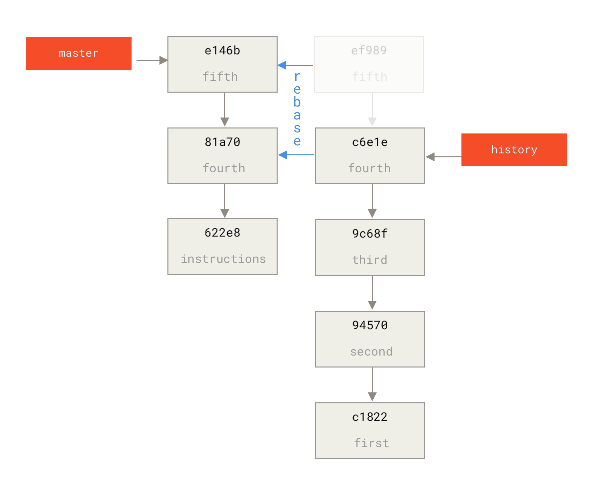

### Replace

As we’ve emphasized before, the objects in Git’s object database are
unchangeable, but Git does provide an interesting way to *pretend* to
replace objects in its database with other objects.

The `replace` command lets you specify an object in Git and say "every
time you refer to *this* object, pretend it’s a *different* object".
This is most commonly useful for replacing one commit in your history
with another one without having to rebuild the entire history with, say,
`git filter-branch`.

For example, let’s say you have a huge code history and want to split
your repository into one short history for new developers and one much
longer and larger history for people interested in data mining. You can
graft one history onto the other by "replacing" the earliest commit in
the new line with the latest commit on the older one. This is nice
because it means that you don’t actually have to rewrite every commit in
the new history, as you would normally have to do to join them together
(because the parentage affects the SHA-1s).

Let’s try this out. Let’s take an existing repository, split it into two
repositories, one recent and one historical, and then we’ll see how we
can recombine them without modifying the recent repositories SHA-1
values via `replace`.

We’ll use a simple repository with five simple commits:

```shell
$ git log --oneline
ef989d8 Fifth commit
c6e1e95 Fourth commit
9c68fdc Third commit
945704c Second commit
c1822cf First commit
```

We want to break this up into two lines of history. One line goes from
commit one to commit four - that will be the historical one. The second
line will just be commits four and five - that will be the recent
history.


Figure 1. Example Git history

Well, creating the historical history is easy, we can just put a branch
in the history and then push that branch to the `master` branch of a new
remote repository.

```shell
$ git branch history c6e1e95
$ git log --oneline --decorate
ef989d8 (HEAD, master) Fifth commit
c6e1e95 (history) Fourth commit
9c68fdc Third commit
945704c Second commit
c1822cf First commit
```


Figure 2. Creating a new `history` branch

Now we can push the new `history` branch to the `master` branch of our
new repository:

```shell
$ git remote add project-history https://github.com/schacon/project-history
$ git push project-history history:master
Counting objects: 12, done.
Delta compression using up to 2 threads.
Compressing objects: 100% (4/4), done.
Writing objects: 100% (12/12), 907 bytes, done.
Total 12 (delta 0), reused 0 (delta 0)
Unpacking objects: 100% (12/12), done.
To git@github.com:schacon/project-history.git
 * [new branch]      history -> master
```

OK, so our history is published. Now the harder part is truncating our
recent history down so it’s smaller. We need an overlap so we can
replace a commit in one with an equivalent commit in the other, so we’re
going to truncate this to just commits four and five (so commit four
overlaps).

```shell
$ git log --oneline --decorate
ef989d8 (HEAD, master) Fifth commit
c6e1e95 (history) Fourth commit
9c68fdc Third commit
945704c Second commit
c1822cf First commit
```

It’s useful in this case to create a base commit that has instructions
on how to expand the history, so other developers know what to do if
they hit the first commit in the truncated history and need more. So,
what we’re going to do is create an initial commit object as our base
point with instructions, then rebase the remaining commits (four and
five) on top of it.

To do that, we need to choose a point to split at, which for us is the
third commit, which is `9c68fdc` in SHA-speak. So, our base commit will
be based off of that tree. We can create our base commit using the
`commit-tree` command, which just takes a tree and will give us a brand
new, parentless commit object SHA-1 back.

```shell
$ echo 'Get history from blah blah blah' | git commit-tree 9c68fdc^{tree}
622e88e9cbfbacfb75b5279245b9fb38dfea10cf
```

[TABLE]


Figure 3. Creating a base commit using `commit-tree`

OK, so now that we have a base commit, we can rebase the rest of our
history on top of that with `git rebase --onto`. The `--onto` argument
will be the SHA-1 we just got back from `commit-tree` and the rebase
point will be the third commit (the parent of the first commit we want
to keep, `9c68fdc`):

```shell
$ git rebase --onto 622e88 9c68fdc
First, rewinding head to replay your work on top of it...
Applying: fourth commit
Applying: fifth commit
```



Figure 4. Rebasing the history on top of the base commit

OK, so now we’ve re-written our recent history on top of a throw away
base commit that now has instructions in it on how to reconstitute the
entire history if we wanted to. We can push that new history to a new
project and now when people clone that repository, they will only see
the most recent two commits and then a base commit with instructions.

Let’s now switch roles to someone cloning the project for the first time
who wants the entire history. To get the history data after cloning this
truncated repository, one would have to add a second remote for the
historical repository and fetch:

```shell
$ git clone https://github.com/schacon/project
$ cd project

$ git log --oneline master
e146b5f Fifth commit
81a708d Fourth commit
622e88e Get history from blah blah blah

$ git remote add project-history https://github.com/schacon/project-history
$ git fetch project-history
From https://github.com/schacon/project-history
 * [new branch]      master     -> project-history/master
```

Now the collaborator would have their recent commits in the `master`
branch and the historical commits in the `project-history/master`
branch.

```shell
$ git log --oneline master
e146b5f Fifth commit
81a708d Fourth commit
622e88e Get history from blah blah blah

$ git log --oneline project-history/master
c6e1e95 Fourth commit
9c68fdc Third commit
945704c Second commit
c1822cf First commit
```

To combine them, you can simply call `git replace` with the commit you
want to replace and then the commit you want to replace it with. So we
want to replace the "fourth" commit in the `master` branch with the
"fourth" commit in the `project-history/master` branch:

```shell
$ git replace 81a708d c6e1e95
```

Now, if you look at the history of the `master` branch, it appears to
look like this:

```shell
$ git log --oneline master
e146b5f Fifth commit
81a708d Fourth commit
9c68fdc Third commit
945704c Second commit
c1822cf First commit
```

Cool, right? Without having to change all the SHA-1s upstream, we were
able to replace one commit in our history with an entirely different
commit and all the normal tools (`bisect`, `blame`, etc) will work how
we would expect them to.


Figure 5. Combining the commits with `git replace`

Interestingly, it still shows `81a708d` as the SHA-1, even though it’s
actually using the `c6e1e95` commit data that we replaced it with. Even
if you run a command like `cat-file`, it will show you the replaced
data:

```shell
$ git cat-file -p 81a708d
tree 7bc544cf438903b65ca9104a1e30345eee6c083d
parent 9c68fdceee073230f19ebb8b5e7fc71b479c0252
author Scott Chacon <schacon@gmail.com> 1268712581 -0700
committer Scott Chacon <schacon@gmail.com> 1268712581 -0700

fourth commit
```

Remember that the actual parent of `81a708d` was our placeholder commit
(`622e88e`), not `9c68fdce` as it states here.

Another interesting thing is that this data is kept in our references:

```shell
$ git for-each-ref
e146b5f14e79d4935160c0e83fb9ebe526b8da0d commit refs/heads/master
c6e1e95051d41771a649f3145423f8809d1a74d4 commit refs/remotes/history/master
e146b5f14e79d4935160c0e83fb9ebe526b8da0d commit refs/remotes/origin/HEAD
e146b5f14e79d4935160c0e83fb9ebe526b8da0d commit refs/remotes/origin/master
c6e1e95051d41771a649f3145423f8809d1a74d4 commit refs/replace/81a708dd0e167a3f691541c7a6463343bc457040
```

This means that it’s easy to share our replacement with others, because
we can push this to our server and other people can easily download it.
This is not that helpful in the history grafting scenario we’ve gone
over here (since everyone would be downloading both histories anyhow, so
why separate them?) but it can be useful in other circumstances.

Last updated 2024-03-09 10:34:16 +0800
