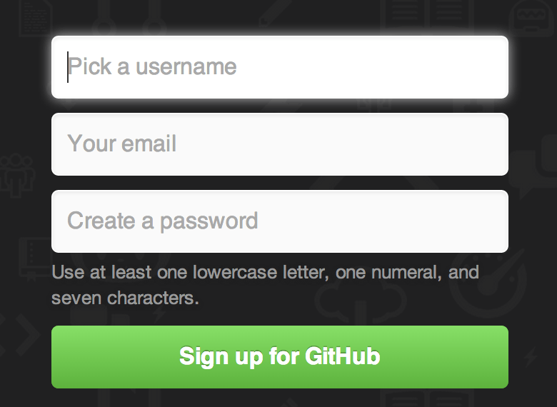
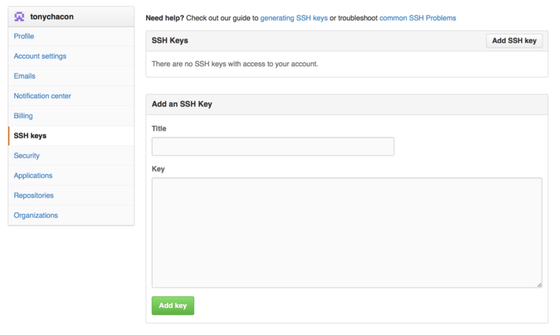
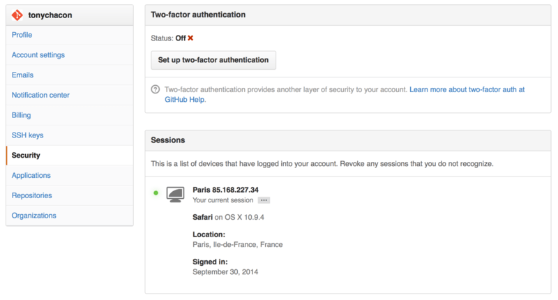

### Account Setup and Configuration

The first thing you need to do is set up a free user account. Simply
visit [https://github.com](https://github.com), choose a user name that
isn’t already taken, provide an email address and a password, and click
the big green “Sign up for GitHub” button.

Figure 1. The GitHub sign-up form

The next thing you’ll see is the pricing page for upgraded plans, but
it’s safe to ignore this for now. GitHub will send you an email to
verify the address you provided. Go ahead and do this; it’s pretty
important (as we’ll see later).

[TABLE]

Clicking the Octocat logo at the top-left of the screen will take you to
your dashboard page. You’re now ready to use GitHub.

#### SSH Access

As of right now, you’re fully able to connect with Git repositories
using the `https://` protocol, authenticating with the username and
password you just set up. However, to simply clone public projects, you
don’t even need to sign up - the account we just created comes into play
when we fork projects and push to our forks a bit later.

If you’d like to use SSH remotes, you’ll need to configure a public key.
If you don’t already have one, see
[ch04-git-on-the-server](ch04-git-on-the-server.md#generate_ssh_key).
Open up your account settings using the link at the top-right of the
window:

Figure 2. The “Account settings” link

Then select the “SSH keys” section along the left-hand side.

Figure 3. The “SSH keys” link

From there, click the “Add an SSH key” button, give your key a name,
paste the contents of your `~/.ssh/id_rsa.pub` (or whatever you named
it) public-key file into the text area, and click “Add key”.

[TABLE]

#### Your Avatar

Next, if you wish, you can replace the avatar that is generated for you
with an image of your choosing. First go to the “Profile” tab (above the
SSH Keys tab) and click “Upload new picture”.

Figure 4. The “Profile” link

We’ll choose a copy of the Git logo that is on our hard drive and then
we get a chance to crop it.

Figure 5. Crop your uploaded avatar

Now anywhere you interact on the site, people will see your avatar next
to your username.

If you happen to have uploaded an avatar to the popular Gravatar service
(often used for WordPress accounts), that avatar will be used by default
and you don’t need to do this step.

#### Your Email Addresses

The way that GitHub maps your Git commits to your user is by email
address. If you use multiple email addresses in your commits and you
want GitHub to link them up properly, you need to add all the email
addresses you have used to the Emails section of the admin section.

Figure 6. Add all your email addresses

In [Add all your email addresses](#_add_email_addresses) we can see some
of the different states that are possible. The top address is verified
and set as the primary address, meaning that is where you’ll get any
notifications and receipts. The second address is verified and so can be
set as the primary if you wish to switch them. The final address is
unverified, meaning that you can’t make it your primary address. If
GitHub sees any of these in commit messages in any repository on the
site, it will be linked to your user now.

#### Two Factor Authentication

Finally, for extra security, you should definitely set up Two-factor
Authentication or “2FA”. Two-factor Authentication is an authentication
mechanism that is becoming more and more popular recently to mitigate
the risk of your account being compromised if your password is stolen
somehow. Turning it on will make GitHub ask you for two different
methods of authentication, so that if one of them is compromised, an
attacker will not be able to access your account.

You can find the Two-factor Authentication setup under the Security tab
of your Account settings.

Figure 7. 2FA in the Security Tab

If you click on the “Set up two-factor authentication” button, it will
take you to a configuration page where you can choose to use a phone app
to generate your secondary code (a “time based one-time password”), or
you can have GitHub send you a code via SMS each time you need to log
in.

After you choose which method you prefer and follow the instructions for
setting up 2FA, your account will then be a little more secure and you
will have to provide a code in addition to your password whenever you
log into GitHub.

Last updated 2024-03-09 10:34:11 +0800
