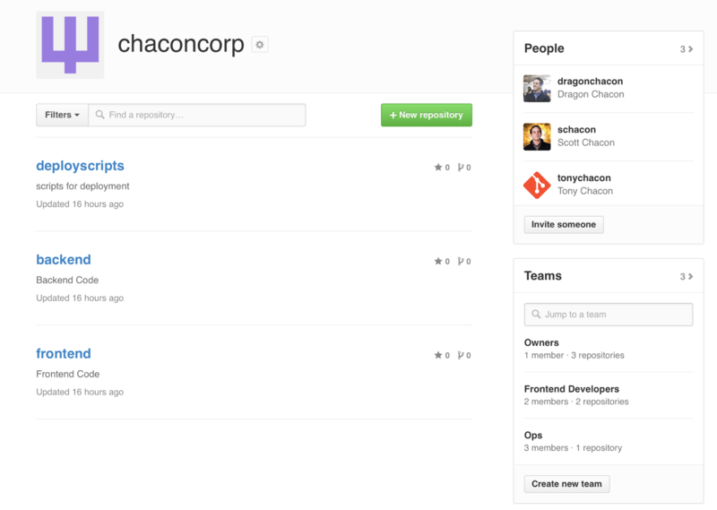
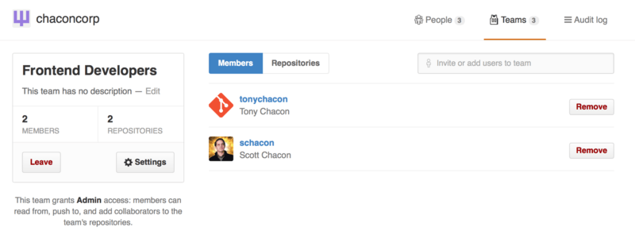

### Managing an organization

In addition to single-user accounts, GitHub has what are called
Organizations. Like personal accounts, Organizational accounts have a
namespace where all their projects exist, but many other things are
different. These accounts represent a group of people with shared
ownership of projects, and there are many tools to manage subgroups of
those people. Normally these accounts are used for Open Source groups
(such as “perl” or “rails”) or companies (such as “google” or
“twitter”).

#### Organization Basics

An organization is pretty easy to create; just click on the “+” icon at
the top-right of any GitHub page, and select “New organization” from the
menu.

Figure 1. The “New organization” menu item

First you’ll need to name your organization and provide an email address
for a main point of contact for the group. Then you can invite other
users to be co-owners of the account if you want to.

Follow these steps and you’ll soon be the owner of a brand-new
organization. Like personal accounts, organizations are free if
everything you plan to store there will be open source.

As an owner in an organization, when you fork a repository, you’ll have
the choice of forking it to your organization’s namespace. When you
create new repositories you can create them either under your personal
account or under any of the organizations that you are an owner in. You
also automatically “watch” any new repository created under these
organizations.

Just like in [\[\_personal_avatar\]](#_personal_avatar), you can upload
an avatar for your organization to personalize it a bit. Also just like
personal accounts, you have a landing page for the organization that
lists all of your repositories and can be viewed by other people.

Now let’s cover some of the things that are a bit different with an
organizational account.

#### Teams

Organizations are associated with individual people by way of teams,
which are simply a grouping of individual user accounts and repositories
within the organization and what kind of access those people have in
those repositories.

For example, say your company has three repositories: `frontend`,
`backend`, and `deployscripts`. You’d want your HTML/CSS/JavaScript
developers to have access to `frontend` and maybe `backend`, and your
Operations people to have access to `backend` and `deployscripts`. Teams
make this easy, without having to manage the collaborators for every
individual repository.

The Organization page shows you a simple dashboard of all the
repositories, users and teams that are under this organization.

Figure 2. The Organization page

To manage your Teams, you can click on the Teams sidebar on the right
hand side of the page in [The Organization page](#_org_page). This will
bring you to a page you can use to add members to the team, add
repositories to the team or manage the settings and access control
levels for the team. Each team can have read only, read/write or
administrative access to the repositories. You can change that level by
clicking the “Settings” button in [The Team page](#_team_page).

Figure 3. The Team page

When you invite someone to a team, they will get an email letting them
know they’ve been invited.

Additionally, team `@mentions` (such as `@acmecorp/frontend`) work much
the same as they do with individual users, except that **all** members
of the team are then subscribed to the thread. This is useful if you
want the attention from someone on a team, but you don’t know exactly
who to ask.

A user can belong to any number of teams, so don’t limit yourself to
only access-control teams. Special-interest teams like `ux`, `css`, or
`refactoring` are useful for certain kinds of questions, and others like
`legal` and `colorblind` for an entirely different kind.

#### Audit Log

Organizations also give owners access to all the information about what
went on under the organization. You can go to the 'Audit Log' tab and
see what events have happened at an organization level, who did them and
where in the world they were done.

Figure 4. The Audit log

You can also filter down to specific types of events, specific places or
specific people.

Last updated 2024-03-09 10:34:13 +0800
