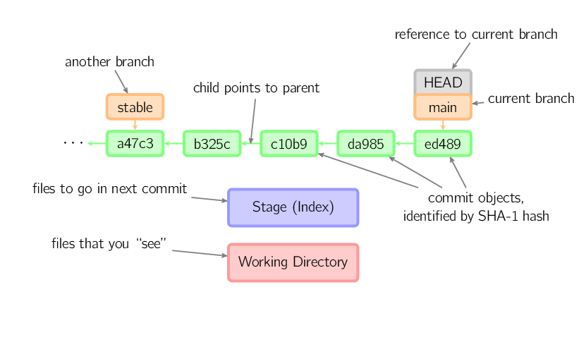

## Conventions

In the rest of this document, we will use graphs of the following form.

Commits are shown in green as 5-character IDs, and they point to their
parents. Branches are shown in orange, and they point to particular
commits. The current branch is identified by the special reference
*HEAD*, which is "attached" to that branch. In this image, the five
latest commits are shown, with *ed489* being the most recent. *main*
(the current branch) points to this commit, while *stable* (another
branch) points to an ancestor of *main*'s commit.

