## Commands in Detail

### Diff

There are various ways to look at differences between commits. Below are
some common examples. Any of these commands can optionally take extra
filename arguments that limit the differences to the named files.

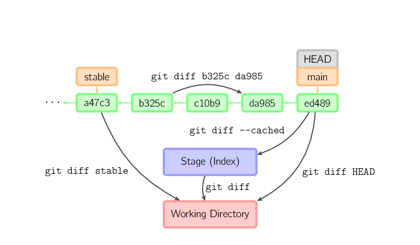

### Commit

When you commit, git creates a new commit object using the files from
the stage and sets the parent to the current commit. It then points the
current branch to this new commit. In the image below, the current
branch is *main*. Before the command was run, *main* pointed to *ed489*.
Afterward, a new commit, *f0cec*, was created, with parent *ed489*, and
then *main* was moved to the new commit.

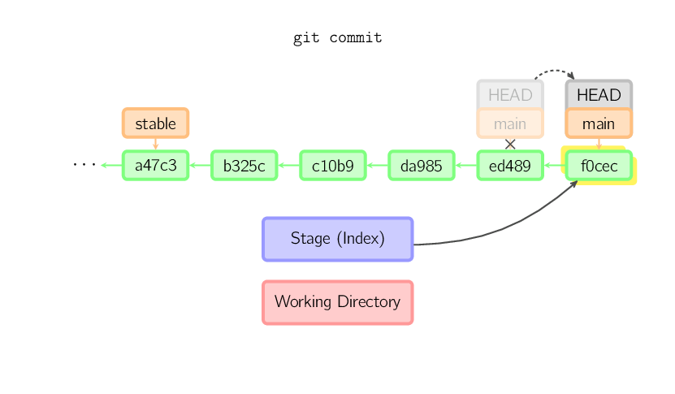

This same process happens even when the current branch is an ancestor of
another. Below, a commit occurs on branch *stable*, which was an
ancestor of *main*, resulting in *1800b*. Afterward, *stable* is no
longer an ancestor of *main*. To join the two histories, a
[merge](#merge) (or [rebase](#rebase)) will be necessary.

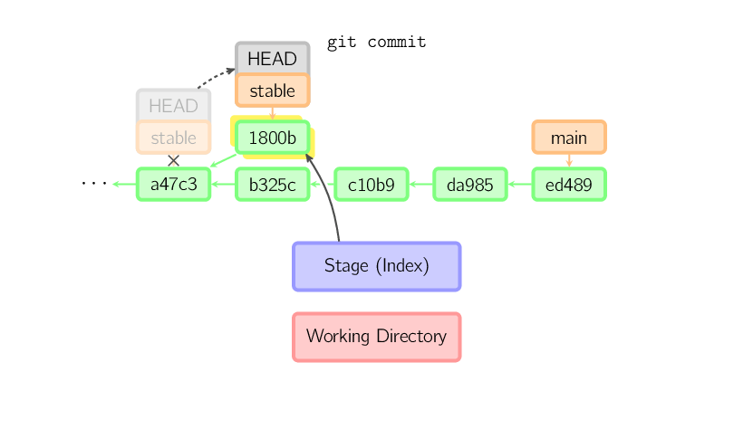

Sometimes a mistake is made in a commit, but this is easy to correct
with `git commit --amend`. When you use this command, git creates a new
commit with the same parent as the current commit. (The old commit will
be discarded if nothing else references it.)

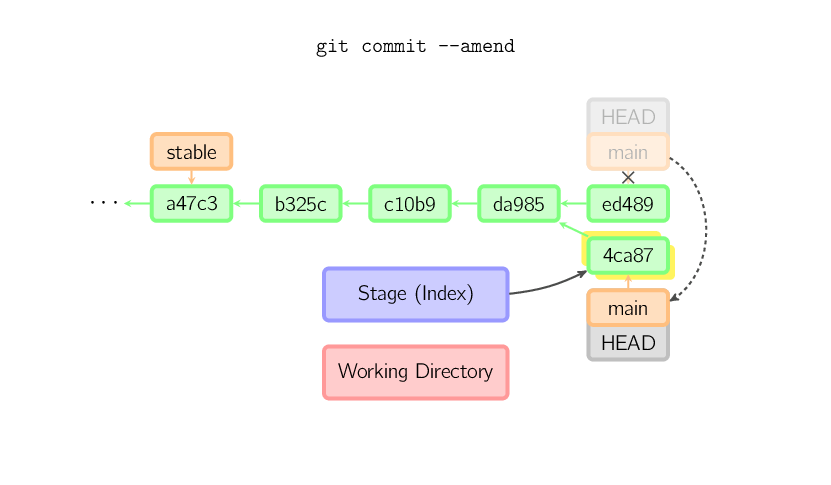

A fourth case is committing with a [detached HEAD](#detached), as
explained later.

### Checkout

The checkout command is used to copy files from the history (or stage)
to the working directory, and to optionally switch branches.

When a filename (and/or `-p`) is given, git copies those files from the
given commit to the stage and the working directory. For example,
`git checkout HEAD~ foo.c` copies the file `foo.c` from the commit
called *HEAD~* (the parent of the current commit) to the working
directory, and also stages it. (If no commit name is given, files are
copied from the stage.) Note that the current branch is not changed.

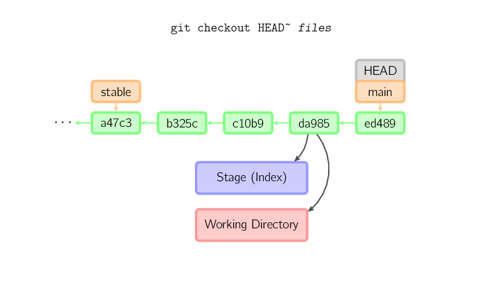

When a filename is *not* given but the reference is a (local) branch,
*HEAD* is moved to that branch (that is, we "switch to" that branch),
and then the stage and working directory are set to match the contents
of that commit. Any file that exists in the new commit (*a47c3* below)
is copied; any file that exists in the old commit (*ed489*) but not in
the new one is deleted; and any file that exists in neither is ignored.

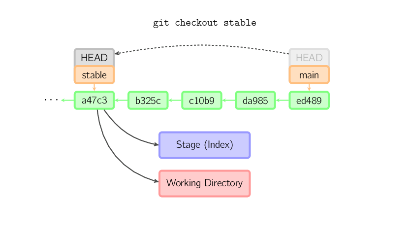

When a filename is *not* given and the reference is *not* a (local)
branch — say, it is a tag, a remote branch, a SHA-1 ID, or something
like *main~3* — we get an anonymous branch, called a *detached HEAD*.
This is useful for jumping around the history. Say you want to compile
version 1.6.6.1 of git. You can `git checkout v1.6.6.1` (which is a tag,
not a branch), compile, install, and then switch back to another branch,
say `git checkout main`. However, committing works slightly differently
with a detached HEAD; this is covered [below](#detached).

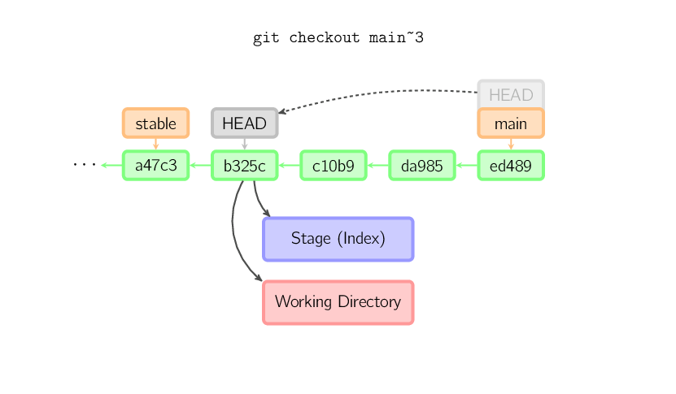

### Committing with a Detached HEAD

When *HEAD* is detached, commits work like normal, except no named
branch gets updated. (You can think of this as an anonymous branch.)

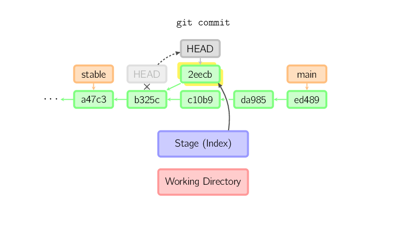

Once you check out something else, say *main*, the commit is
(presumably) no longer referenced by anything else, and gets lost. Note
that after the command, there is nothing referencing *2eecb*.

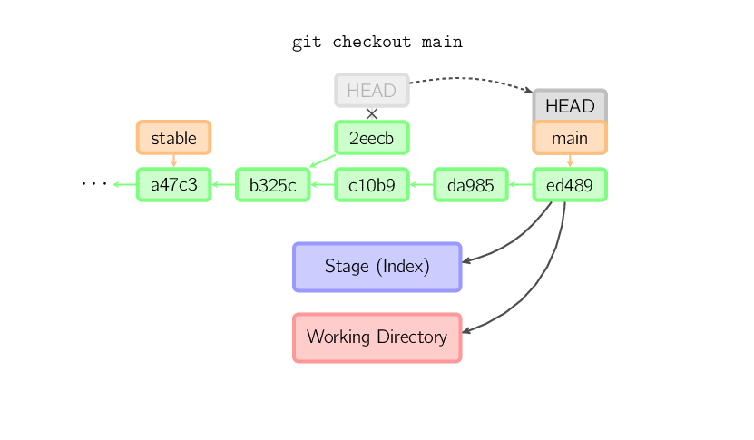

If, on the other hand, you want to save this state, you can create a new
named branch using `git checkout -b `*`name`*.

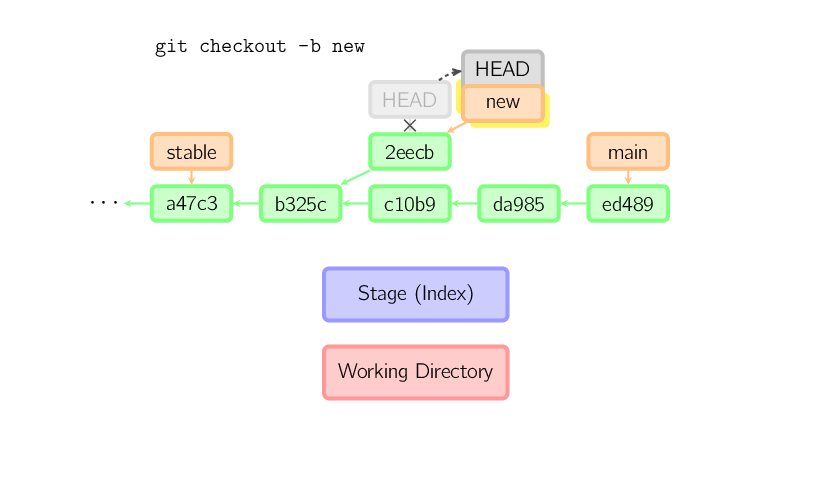

### Reset

The reset command moves the current branch to another position, and
optionally updates the stage and the working directory. It also is used
to copy files from the history to the stage without touching the working
directory.

If a commit is given with no filenames, the current branch is moved to
that commit, and then the stage is updated to match this commit. If
`--hard` is given, the working directory is also updated. If `--soft` is
given, neither is updated.

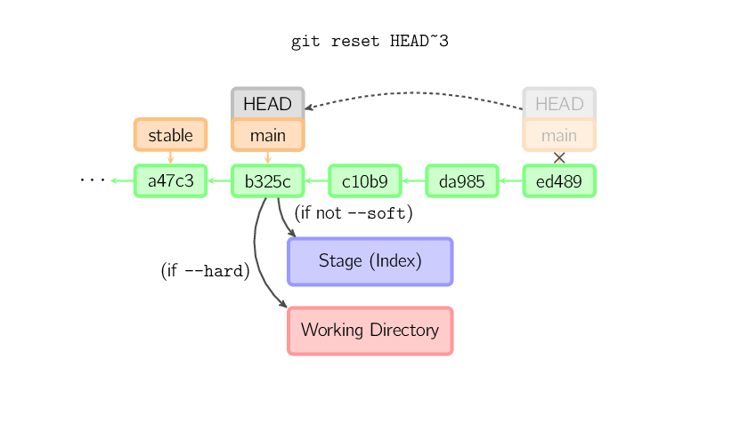

If a commit is not given, it defaults to *HEAD*. In this case, the
branch is not moved, but the stage (and optionally the working
directory, if `--hard` is given) are reset to the contents of the last
commit.

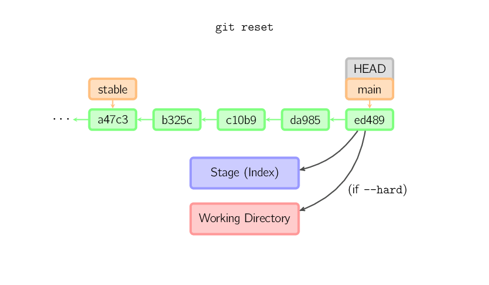

If a filename (and/or `-p`) is given, then the command works similarly
to [checkout](#checkout) with a filename, except only the stage (and not
the working directory) is updated. (You may also specify the commit from
which to take files, rather than *HEAD*.)

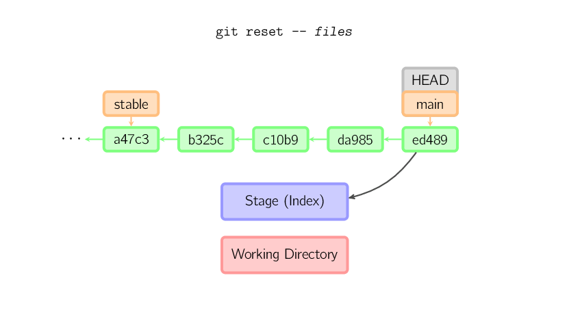

### Merge

A merge creates a new commit that incorporates changes from other
commits. Before merging, the stage must match the current commit. The
trivial case is if the other commit is an ancestor of the current
commit, in which case nothing is done. The next most simple is if the
current commit is an ancestor of the other commit. This results in a
*fast-forward* merge. The reference is simply moved, and then the new
commit is checked out.

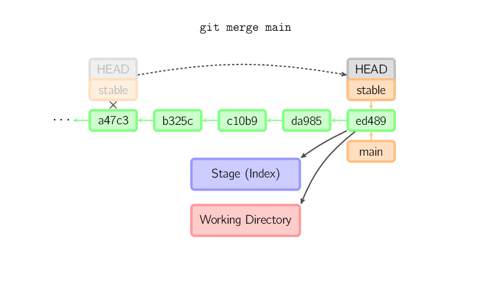

Otherwise, a "real" merge must occur. You can choose other strategies,
but the default is to perform a "recursive" merge, which basically takes
the current commit (*ed489* below), the other commit (*33104*), and
their common ancestor (*b325c*), and performs a [three-way
merge](http://en.wikipedia.org/wiki/Three-way_merge). The result is
saved to the working directory and the stage, and then a commit occurs,
with an extra parent (*33104*) for the new commit.

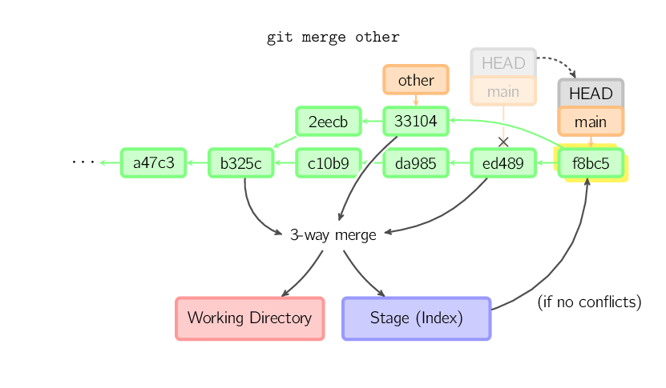

### Cherry Pick

The cherry-pick command "copies" a commit, creating a new commit on the
current branch with the same message and patch as another commit.

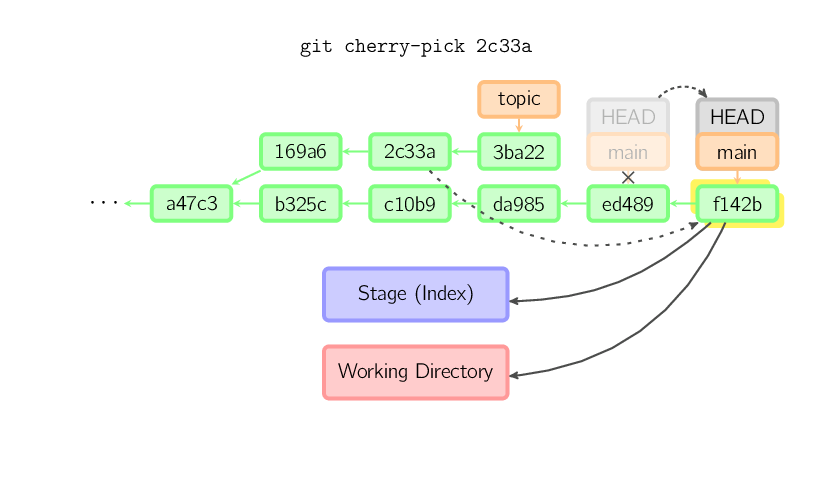

### Rebase

A rebase is an alternative to a [merge](#merge) for combining multiple
branches. Whereas a merge creates a single commit with two parents,
leaving a non-linear history, a rebase replays the commits from the
current branch onto another, leaving a linear history. In essence, this
is an automated way of performing several [cherry-pick](#cherry-pick)s
in a row.

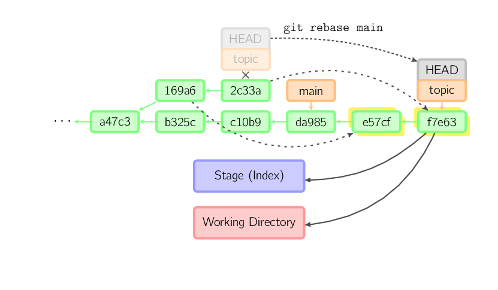

The above command takes all the commits that exist in *topic* but not in
*main* (namely *169a6* and *2c33a*), replays them onto *main*, and then
moves the branch head to the new tip. Note that the old commits will be
garbage collected if they are no longer referenced.

To limit how far back to go, use the `--onto` option. The following
command replays onto *main* the most recent commits on the current
branch since *169a6* (exclusive), namely *2c33a*.

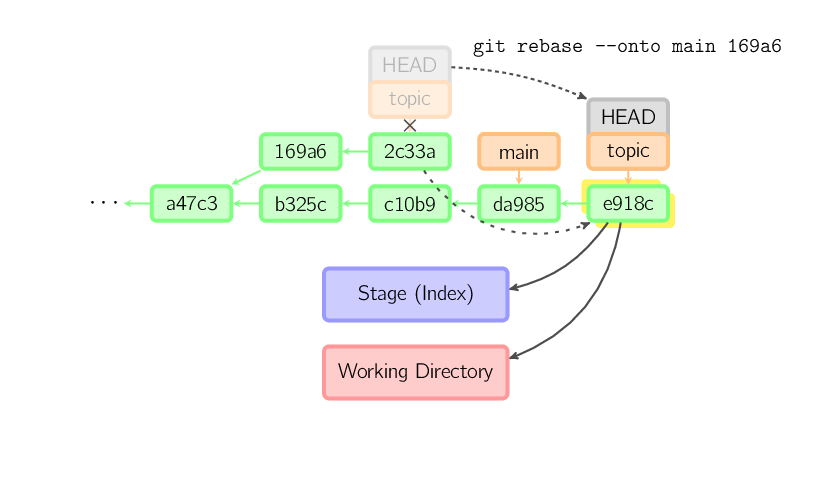

There is also `git rebase --interactive`, which allows one to do more
complicated things than simply replaying commits, namely dropping,
reordering, modifying, and squashing commits. There is no obvious
picture to draw for this; see
[git-rebase(1)](http://www.kernel.org/pub/software/scm/git/docs/git-rebase.html#_interactive_mode)
for more details.
