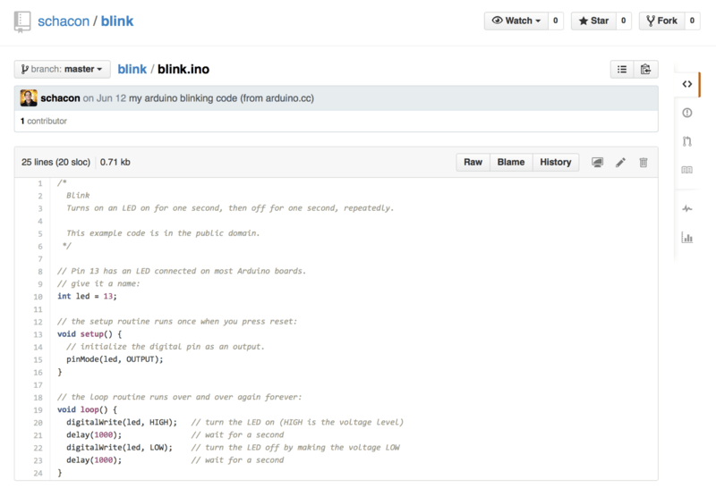
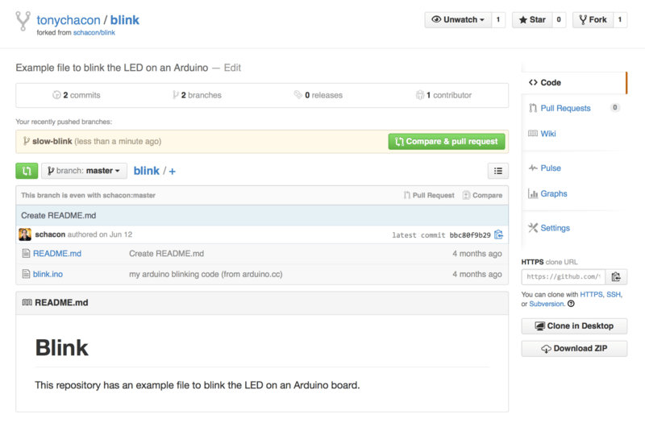
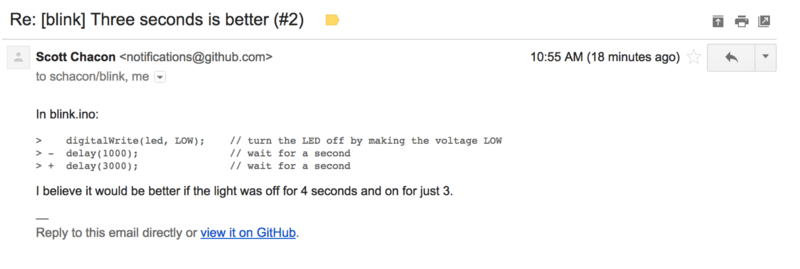
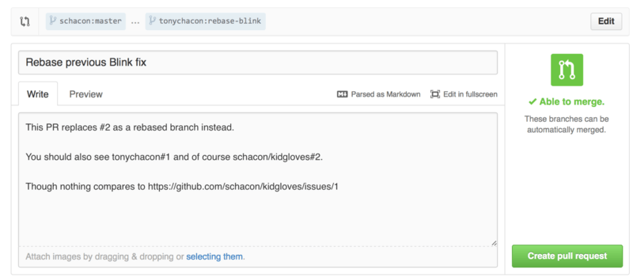
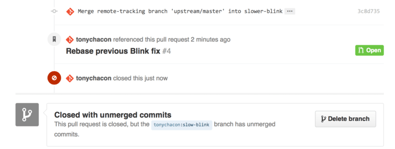
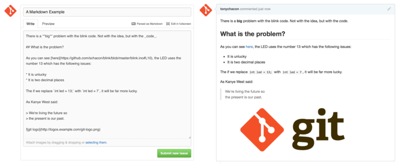
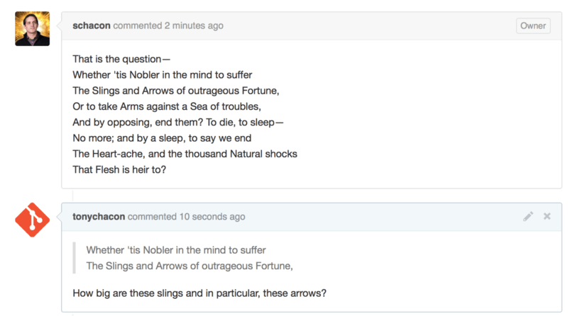
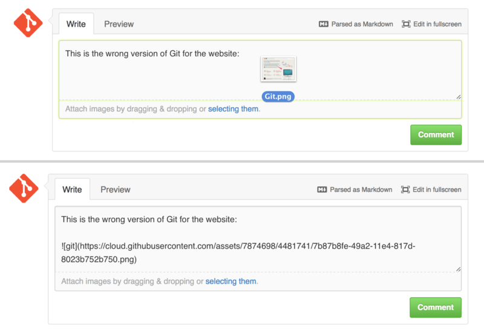

### 对项目做出贡献

账户已经建立好了，现在我们来了解一些能帮助你对现有的项目做出贡献的知识。

#### 派生项目

如果你想要参与某个项目，但是并没有推送权限，这时可以对这个项目进行“派生（Fork）”。
当你“派生”一个项目时，GitHub
会在你的空间中创建一个完全属于你的项目副本，且你对其具有推送权限。

[TABLE]

通过这种方式，项目的管理者不再需要忙着把用户添加到贡献者列表并给予他们推送权限。
人们可以派生这个项目，将修改推送到派生出的项目副本中，并通过创建拉取请求（Pull
Request，简称 PR）来让他们的改动进入源版本库，下文我们会详细说明。
创建了拉取请求后，就会开启一个可供审查代码的板块，项目的拥有者和贡献者可以在此讨论相关修改，直到项目拥有者对其感到满意，并且认为这些修改可以被合并到版本库。

你可以通过点击项目页面右上角的“Fork”按钮，来派生这个项目。


Figure 1. “Fork”按钮

稍等片刻，你将被转到新项目页面，该项目包含可写的代码副本。

#### GitHub 流程

GitHub 设计了一个以拉取请求为中心的特殊合作流程。 它基于我们在
\<[ch03-git-branching](ch03-git-branching.md#topic_branch) 的
[ch03-git-branching](ch03-git-branching.md#ch03-git-branching)
中提到的工作流程。
不管你是在一个紧密的团队中使用单独的版本库，或者使用许多的“Fork”来为一个由陌生人组成的国际企业或网络做出贡献，这种合作流程都能应付。

流程通常如下：

1.  派生一个项目

2.  从 `master` 分支创建一个新分支

3.  提交一些修改来改进项目

4.  将这个分支推送到 GitHub 上

5.  创建一个拉取请求

6.  讨论，根据实际情况继续修改

7.  项目的拥有者合并或关闭你的拉取请求

8.  将更新后的 `master` 分支同步到你的派生中

这基本和
[ch05-distributed-git](ch05-distributed-git.md#integration_manager)
中的一体化管理流程差不多，但是团队可以使用 GitHub
提供的网页工具替代电子邮件来交流和审查修改。

现在我们来看一个使用这个流程的例子。

##### 创建拉取请求

Tony 在找一些能在他的 Arduino 微控制器上运行的代码，他觉得
[https://github.com/schacon/blink](https://github.com/schacon/blink)
中的代码不错。



Figure 2. 他想要做出贡献的项目

但是有个问题，这个代码中的闪烁频率太高，我们觉得 3 秒一次比 1
秒一次更好一些。
所以让我们来改进这个程序，并将修改后的代码提交给这个项目。

首先，单击“Fork”按钮来获得这个项目的副本。
我们使用的用户名是“tonychacon”，所以这个项目副本的访问地址是：
[`https://github.com/tonychacon/blink`](https://github.com/tonychacon/blink)
。 我们将它克隆到本地，创建一个分支，修改代码，最后再将改动推送到
GitHub。

```shell
$ git clone https://github.com/tonychacon/blink (1)
Cloning into 'blink'...

$ cd blink
$ git checkout -b slow-blink (2)
Switched to a new branch 'slow-blink'

$ sed -i '' 's/1000/3000/' blink.ino (macOS) (3)
# If you're on a Linux system, do this instead:
# $ sed -i 's/1000/3000/' blink.ino (3)

$ git diff --word-diff (4)
diff --git a/blink.ino b/blink.ino
index 15b9911..a6cc5a5 100644
--- a/blink.ino
+++ b/blink.ino
@@ -18,7 +18,7 @@ void setup() {
// the loop routine runs over and over again forever:
void loop() {
  digitalWrite(led, HIGH);   // turn the LED on (HIGH is the voltage level)
  [-delay(1000);-]{+delay(3000);+}               // wait for a second
  digitalWrite(led, LOW);    // turn the LED off by making the voltage LOW
  [-delay(1000);-]{+delay(3000);+}               // wait for a second
}

$ git commit -a -m 'three seconds is better' (5)
[slow-blink 5ca509d] three seconds is better
 1 file changed, 2 insertions(+), 2 deletions(-)

$ git push origin slow-blink (6)
Username for 'https://github.com': tonychacon
Password for 'https://tonychacon@github.com':
Counting objects: 5, done.
Delta compression using up to 8 threads.
Compressing objects: 100% (3/3), done.
Writing objects: 100% (3/3), 340 bytes | 0 bytes/s, done.
Total 3 (delta 1), reused 0 (delta 0)
To https://github.com/tonychacon/blink
 * [new branch]      slow-blink -> slow-blink
```

1.  将派生出的副本克隆到本地

2.  创建出名称有意义的分支

3.  修改代码

4.  检查改动

5.  将改动提交到分支中

6.  将新分支推送到 GitHub 的副本中

现在到 GitHub 上查看之前的项目副本，可以看到 GitHub 提示我们有新的分支，
并且显示了一个大大的绿色按钮让我们可以检查我们的改动，并给源项目创建拉取请求。

你也可以到“Branches”（分支）页面查看分支并创建拉取请求：
`https://github.com/<用户名>/<项目名>/branches`



Figure 3. 拉取请求按钮

如果我们点击那个绿色按钮，就会跳到一个新页面，在这里我们可以为拉取请求填写标题和描述。
花点时间编写一个清晰有用的描述是非常值得的，这能让原项目拥有者明白你做了什么，
为什么这个改动是正确的，以及接受此更改是否能够改进他的项目。

同时我们也能看到比主分支中所“领先”（ahead）的提交（在这个例子中只有一个）以及所有将会被合并的改动与之前代码的对比。


Figure 4. 拉取请求创建页面

当你单击了“Create pull
request”（创建拉取请求）的按钮后，这个项目的拥有者将会收到一条包含关改动和拉取请求页面的链接的提醒。

[TABLE]

##### 利用拉取请求

现在，项目的拥有者可以看到你的改动并合并它，拒绝它或是发表评论。
在这里我们就当作他喜欢这个点子，但是他想要让灯熄灭的时间比点亮的时间稍长一些。

接下来可能会通过电子邮件进行互动，就像我们在
[ch05-distributed-git](ch05-distributed-git.md#ch05-distributed-git)
中提到的工作流程那样，但是在 GitHub，这些都在线上完成。
项目的拥有者可以审查修改，只需要单击某一行，就可以对其发表评论。


Figure 5. 对拉取请求内的特定一行发表评论

当维护者发表评论后，提交拉取请求的人，以及所有正在关注（Watching）这个版本库的用户都会收到通知。
我们待会儿将会告诉你如何修改这项设置。现在，如果 Tony
有开启电子邮件提醒，他将会收到这样的一封邮件：



Figure 6. 通过电子邮件发送的评论提醒

每个人都能在拉取请求中发表评论。在 [拉取请求讨论页面](#_pr_discussion)
里我们可以看到项目拥有者对某行代码发表评论，
并在讨论区留下了一个普通评论。你可以看到被评论的代码也会在互动中显示出来。


Figure 7. 拉取请求讨论页面

现在贡献者可以看到如何做才能让他们的改动被接受。幸运的是，这也是一件轻松的事情。
如果你使用的是电子邮件进行交流，你需要再次对代码进行修改并重新提交至邮件列表，
这些修改会自动更新到拉取请求上。在 [最终的拉取请求](#_pr_final)
中，你也可以在更新后的拉取请求中看到已折叠的旧代码评论，
因为它是在修改后的行上添加的评论。

对现有的拉取请求添加提交并不会触发提醒，因此 Tony 在推送了他的修正后，
还需要通过评论告知项目拥有者他完成了修改请求。


Figure 8. 最终的拉取请求

如果你点开拉取请求的“Files
Changed”（更改的文件）选项卡，你将会看到“整理过的”差异表 ——
也就是这个分支被合并到主分支之后将会产生的所有改动， 其实就是
`git diff master…​<分支名>` 命令的执行结果。 你可以浏览
[ch05-distributed-git](ch05-distributed-git.md#what_is_introduced)
来了解更多关于差异表的知识。

你还会注意到，GitHub
会检查你的拉取请求是否能直接合并，如果可以，将会提供一个按钮来进行合并操作。
这个按钮只在你对版本库有写入权限并且可以进行简洁合并时才会显示。
你点击后 GitHub 将做出一个“非快进式”（non-fast-forward）合并，
即使这个合并 **能够** 快进式（fast-forward）合并，GitHub
依然会创建一个合并提交。

如果你需要，你还可以将分支拉取并在本地合并。 如果你将这个分支合并到
`master` 分支中并推送到 GitHub，这个拉取请求会被自动关闭。

这就是大部分 GitHub
项目使用的工作流程。创建分支，基于分支创建拉取请求，进行讨论，
根据需要继续在分支上进行修改，最终关闭或合并拉取请求。

[TABLE]

#### 拉取请求的进阶用法

目前，我们学到了如何在 GitHub
平台对一个项目进行最基础的贡献。现在我们会教给你一些小技巧，让你可以更加有效率地使用拉取请求。

##### 将拉取请求制作成补丁

有一件重要的事情：和大部分通过邮件列表工作的项目对补丁贡献的看法一样，
许多项目并不认为拉取请求可以作为补丁。 大多数的 GitHub
项目将拉取请求的分支当作对改动的交流方式，并将变更集合起来统一进行合并。

这是个重要的差异，因为一般来说改动会在代码完成前提出，这和基于邮件列表的补丁贡献有着天差地别。
这使得维护者们可以更早的沟通，由社区中的力量能提出更好的方案。
当有人从拉取请求提交了一些代码，并且维护者和社区提出了一些意见，这个补丁系列并不需要从头来过，
只需要将改动重新提交并推送到分支中，这使得讨论的背景和过程可以齐头并进。

举个例子，你可以回去看看
[最终的拉取请求](#_pr_final)，你会注意到贡献者没有变基他的提交再提交一个新的拉取请求，
而是直接增加了新的提交并推送到已有的分支中。
如果你之后再回去查看这个拉取请求，你可以轻松地找到这个修改的原因。
点击网页上的“Merge”（合并）按钮后，会建立一个合并提交并指向这个拉取请求，你就可以很轻松的研究原来的讨论内容。

##### 与上游保持同步

如果你的拉取请求由于过时或其他原因不能干净地合并，你需要进行修复才能让维护者对其进行合并。
GitHub 会对每个提交进行测试，让你知道你的拉取请求能否简洁的合并。


Figure 9. 不能进行干净合并

如果你看到了像 [不能进行干净合并](#_pr_fail)
中的画面，你就需要修复你的分支让这个提示变成绿色，这样维护者就不需要再做额外的工作。

你有两种方法来解决这个问题。你可以把你的分支变基到目标分支中去
（通常是你派生出的版本库中的 `master`
分支），或者你可以合并目标分支到你的分支中去。

GitHub 上的大多数的开发者会使用后一种方法，基于我们在上一节提到的理由：
我们最看重的是历史记录和最后的合并，变基除了给你带来看上去简洁的历史记录，
只会让你的工作变得更加困难且更容易犯错。

如果你想要合并目标分支来让你的拉取请求变得可合并，你需要将源版本库添加为一个新的远端，并从远端抓取内容，合并主分支的内容到你的分支中去，修复所有的问题并最终重新推送回你提交拉取请求使用的分支。

在这个例子中，我们再次使用之前的“tonychacon”用户来进行示范，源作者提交了一个改动，
使得拉取请求和它产生了冲突。现在来看我们解决这个问题的步骤。

```shell
$ git remote add upstream https://github.com/schacon/blink (1)

$ git fetch upstream (2)
remote: Counting objects: 3, done.
remote: Compressing objects: 100% (3/3), done.
Unpacking objects: 100% (3/3), done.
remote: Total 3 (delta 0), reused 0 (delta 0)
From https://github.com/schacon/blink
 * [new branch]      master     -> upstream/master

$ git merge upstream/master (3)
Auto-merging blink.ino
CONFLICT (content): Merge conflict in blink.ino
Automatic merge failed; fix conflicts and then commit the result.

$ vim blink.ino (4)
$ git add blink.ino
$ git commit
[slow-blink 3c8d735] Merge remote-tracking branch 'upstream/master' \
    into slower-blink

$ git push origin slow-blink (5)
Counting objects: 6, done.
Delta compression using up to 8 threads.
Compressing objects: 100% (6/6), done.
Writing objects: 100% (6/6), 682 bytes | 0 bytes/s, done.
Total 6 (delta 2), reused 0 (delta 0)
To https://github.com/tonychacon/blink
   ef4725c..3c8d735  slower-blink -> slow-blink
```

1.  将源版本库添加为一个远端，并命名为“upstream”（上游）

2.  从远端抓取最新的内容

3.  将该仓库的主分支的内容合并到你的分支中

4.  修复产生的冲突

5.  再推送回同一个分支

你完成了上面的步骤后，拉取请求将会自动更新并重新检查是否能干净的合并。


Figure 10. 拉取请求现在可以干净地合并了

Git
的伟大之处就是你可以一直重复以上操作。如果你有一个运行了十分久的项目，
你可以轻松地合并目标分支且只需要处理最近的一次冲突，这使得管理流程更加容易。

如果你一定想对分支做变基并进行清理，你可以这么做，但是强烈建议你不要强行地提交到已经提交了拉取请求的分支。
如果其他人拉取了这个分支并进行一些修改，你将会遇到
[ch03-git-branching](ch03-git-branching.md#rebase_peril)
中提到的问题。 相对的，将变基后的分支推送到 GitHub
上的一个新分支中，并且创建一个全新的拉取请求引用旧的拉取请求，然后关闭旧的拉取请求。

##### 参考

你的下个问题可能是“我该如何引用旧的拉取请求？”。 有许多方法可以让你在
GitHub 上的几乎任何地方引用其他东西。

先从如何对拉取请求或议题（Issue）进行相互引用开始。所有的拉取请求和议题在项目中都会有一个独一无二的编号。
举个例子，你无法同时拥有 3 号拉取请求和 3
号议题。如果你想要引用任何一个拉取请求或议题，
你只需要在提交或描述中输入 `#<编号>` 即可。
你也可以指定引用其他版本库的议题或拉取请求，如果你想要引用其他人对该版本库的“Fork”中的议题或拉取请求，
输入 `用户名#<编号>` ，如果在不同的版本库中，输入
`用户名/版本库名#<编号>` 。

我们来看一个例子。假设我们对上个例子中的分支进行了变基，并为此创建一个新的拉取请求，
现在我们希望能在新的拉取请求中引用旧的拉取请求。
我们同时希望引用一个派生出的项目中的议题和一个完全不同的项目中的议题，
就可以像 [在拉取请求中的交叉引用](#_pr_references) 这样填写描述。



Figure 11. 在拉取请求中的交叉引用

当我们提交了这个拉取请求，我们将会看到以上内容被渲染成这样：[在拉取请求中渲染后的交叉引用](#_pr_references_render)


Figure 12. 在拉取请求中渲染后的交叉引用

你会注意到完整的 GitHub 地址被简化了，只留下了必要的信息。

如果 Tony 回去关闭了源拉取请求，我们可以看到一个被引用的提示， GitHub
会自动的反向追踪事件并显示在拉取请求的时间轴上。
这意味着任何查看这个拉取请求的人可以轻松地访问新的拉取请求。
这个链接就像 [在拉取请求中渲染后的交叉引用](#_pr_closed) 中展示的那样。



Figure 13. 在拉取请求中渲染后的交叉引用

除了议题编号外，你还可以通过使用提交的 SHA-1 来引用提交。
你必须完整的写出 40 位长的 SHA-1，GitHub
会在评论中自动地产生指向这个提交的链接。
同样的，你可以像引用议题一样对派生的项目中的提交或者其他项目中的提交进行引用。

#### GitHub 风格的 Markdown

对于在 GitHub 中绝大多数文本框中能够做到的事，引用其他议题只是个开始。
在议题和拉取请求的描述，评论和代码评论还有其他地方，都可以使用“GitHub
风格的 Markdown”。 Markdown 可以让你输入纯文本，但是渲染出丰富的内容。

查看 [一个 Markdown 的示例和渲染效果](#_example_markdown)
里的示例来了解如何书写评论或文本，并通过 Markdown 进行渲染。



Figure 14. 一个 Markdown 的示例和渲染效果

##### GitHub 风格的 Markdown

GitHub 风格的 Markdown 增加了一些基础的 Markdown 中做不到的东西。
它在创建拉取请求和议题中的评论和描述时十分有用。

###### 任务列表

第一个 GitHub 专属的 Markdown 功能，特别是用在拉取请求中，就是任务列表。
一个任务列表可以展示出一系列你想要完成的事情，并带有复选框。
把它们放在议题或拉取请求中时，通常可以展示你想要完成的事情。

你可以这样创建一个任务列表：

```shell
- [X] 编写代码
- [ ] 编写所有测试程序
- [ ] 为代码编写文档
```

如果我们将这个列表加入拉取请求或议题的描述中，它将会被渲染 [Markdown
评论中渲染后的任务列表](#_eg_task_lists) 这样。


Figure 15. Markdown 评论中渲染后的任务列表

在拉取请求中，任务列表经常被用来在合并之前展示这个分支将要完成的事情。
最酷的地方就是，你只需要点击复选框，就能更新评论 —— 你不需要直接修改
Markdown。

不仅如此，GitHub 还会将你在议题和拉取请求中的任务列表整理起来集中展示。
举个例子，如果你在一个拉取请求中有任务清单，你将会在所有拉取请求的总览页面上看到它的进度。
这使得人们可以把一个拉取请求分解成不同的小任务，同时便于其他人了解分支的进度。
你可以在 [在拉取请求列表中的任务列表总结](#_task_list_progress)
看到一个例子。


Figure 16. 在拉取请求列表中的任务列表总结

当你在实现一个任务的早期就提交拉取请求，并使用任务清单追踪你的进度，这个功能会十分的有用。

##### 代码片段

你也可以在评论中添加代码片段。这在你想要展示尚未提交到分支中的代码时会十分有用。
它也经常被用在展示无法正常工作的代码或这个拉取请求需要的代码。

你需要用“反引号”将需要添加的代码片段包起来。

````shell
```java
for(int i=0 ; i < 5 ; i++)
{
   System.out.println("i is : " + i);
}
```
````

如果加入语言的名称，就像我们这里加入的“java”一样，GitHub
会自动尝试对摘录的片段进行语法高亮。
在下面的例子中，它最终会渲染成这个样子：
[渲染后的代码片段示例](#_md_code) 。


Figure 17. 渲染后的代码片段示例

##### 引用

如果你在回复一个很长的评论之中的一小段，你只需要复制你需要的片段，并在每行前添加
`>` 符号即可。 事实上，因为这个功能会被经常用到，它也有一个快捷键。
只要你把你要回应的文字选中，并按下 `r`
键，选中的问题会自动引用并填入评论框。

引用的部分就像这样:

```shell
> Whether 'tis Nobler in the mind to suffer
> The Slings and Arrows of outrageous Fortune,

How big are these slings and in particular, these arrows?
```

经过渲染后，就会变成这样： [渲染后的引用示例](#_md_quote)



Figure 18. 渲染后的引用示例

##### 表情符号

最后，我们可以在评论中使用表情符号。这经常出现在 GitHub
的议题和拉取请求的评论中。 GitHub 上甚至有表情助手。如果你在输入评论时以
`:` 开头，自动完成器会帮助你找到你需要的表情。


Figure 19. 表情符号自动完成器

你也可以在评论的任何地方使用 `:<表情名称>:` 来添加表情符号。
举个例子，你可以输入以下文字：

```shell
I :eyes: that :bug: and I :cold_sweat:.

:trophy: for :microscope: it.

:+1: and :sparkles: on this :ship:, it's :fire::poop:!

:clap::tada::panda_face:
```

渲染之后，就会变成这样： [使用了大量表情符号的评论](#_md_emoji)


Figure 20. 使用了大量表情符号的评论

虽然这个功能并不是非常实用，但是它在这种不方便表达感情的媒体里，加入了趣味的元素。

[TABLE]

##### 图片

从技术层面来说，这并不是 GitHub 风格 Markdown 的功能，但是也很有用。
如果不想使用 Markdown 语法来插入图片，GitHub
允许你通过拖拽图片到文本区来插入图片。



Figure 21. 通过拖拽的方式自动插入图片

如果你回去查看 [通过拖拽的方式自动插入图片](#_md_drag)
，你会发现文本区上有个“Parsed as Markdown”的提示。
点击它你可以了解所有能在 GitHub 上使用的 Markdown 功能。

#### 让你的 GitHub 公共仓库保持更新

当你派生了一个 GitHub
仓库之后，你的仓库（即你的“派生”）会独立于原仓库而独立。
特别地，当原仓库有新的提交时，GitHub 会通知你：

```shell
This branch is 5 commits behind progit:master.
（本分支落后 progit:master 5 个提交。）
```

但你的 GitHub 仓库不会被 GitHub
自动更新，这件事必须由你自己来做。还好，这事儿很简单。

第一种方法无需配置。例如，若你从
[`https://github.com/progit/progit2.git`](https://github.com/progit/progit2.git)
派生了项目， 你可以像这样更新你的 `master` 分支：

```shell
$ git checkout master (1)
$ git pull https://github.com/progit/progit2.git (2)
$ git push origin master (3)
```

1.  如果在另一个分支上，就切换到 `master`

2.  从
    [`https://github.com/progit/progit2.git`](https://github.com/progit/progit2.git)
    抓取更改后合并到 `master`

3.  将 `master` 分支推送到 `origin`

这虽然可行，但每次都要输入从哪个 URL
抓取有点麻烦。你可以稍微设置一下来自动完成它：

```shell
$ git remote add progit https://github.com/progit/progit2.git (1)
$ git branch --set-upstream-to=progit/master master (2)
$ git config --local remote.pushDefault origin (3)
```

1.  添加源仓库并取一个名字，这里叫它 `progit`

2.  将 `master` 分支设置为从 `progit` 远端抓取

3.  将默认推送仓库设置为 `origin`

搞定之后，工作流程为更加简单：

```shell
$ git checkout master (1)
$ git pull (2)
$ git push (3)
```

1.  如果在另一个分支上，就切换到 `master`

2.  从 `progit` 抓取更改后合并到 `master`

3.  将 `master` 分支推送到 `origin`

这种方法可能很有用，但也不是没有缺点。如果你向 `master` 提交，再从
`progit` 中拉取，然后推送到 `origin`，Git
会很乐意安静地为您完成这项工作，但不会警告你——所有这些操作在以上设置下都是有效的。
所以你必须注意永远不要直接提交到
`master`，因为该分支实际上属于上游仓库。

Last updated 2024-03-09 10:37:33 +0800
