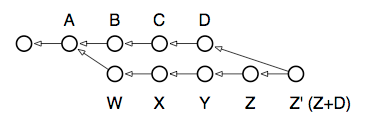
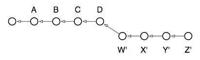

# 分支和变基的威力

Git 中用于操作提交的最有能力的命令之一是名为 rebase 的命令。基本上，你从中工作的每个分支都有一个或多个“基本提交”：该分支诞生的提交。例如，考虑以下典型情况。请注意，箭头指向过去，因为每个提交都引用其父提交（们），但不引用其子提交。因此，D 和 Z 提交代表它们各自分支的头：


在这种情况下，运行 branch 将显示两个“头”：`D` 和 `Z`，两个分支的共同父项为 A。show-branch 的输出向我们展示了这个信息：

```bash
$ git branch
  Z
* D

$ git show-branch
! [Z] Z
 * [D] D
--
 * [D] D
 * [D^] C
 * [D~2] B
+  [Z]Z
+  [Z^]Y
+  [Z~2] X
+  [Z~3] W
+* [D~3] A
```

阅读这个输出需要一些时间来习惯，但实质上它与上面的图表没有太大不同。这里是它告诉我们的内容：

* 我们所在的分支在提交 `A` 处经历了第一次分歧（也称为提交 `D~3`，甚至 `Z~4`，如果你有兴趣的话）。`commit^` 的语法用于引用提交的父提交，而 `commit~3` 则引用其第三个父提交，或曾祖父提交。
* 从下到上阅读，第一列（加号）显示了一个名为 `Z` 的分歧分支，其中包含四个提交：`W`、`X`、`Y` 和 `Z`。
* 第二列（星号）显示了发生在当前分支上的提交，即三个提交：`B`、`C` 和 `D`。
* 输出的顶部，与底部通过一条分割线分开，标识了所显示的分支，它们的提交是由哪一列标记的，以及用于标记的字符。

我们要执行的操作是将工作分支 `Z` 恢复到主分支 `D` 的速度。换句话说，我们想要将 `B`、`C` 和 `D` 的工作合并到 `Z` 中。

在其他版本控制系统中，这样的操作只能使用“分支合并”完成。事实上，在 Git 中仍然可以使用 `merge` 完成分支合并，并且在 `Z` 是已发布分支的情况下，并且我们不希望更改其提交历史时，仍然是必需的。以下是要运行的命令：

```bash
$ git checkout Z # 切换到 Z 分支
$ git merge D # 将提交 B、C 和 D 合并到 Z 中
```

这是操作之后存储库的样子：



如果我们现在检出 `Z` 分支，它将包含之前 `Z` 的内容（现在可以引用为 `Z^`），与 `D` 的内容合并在一起。（但请注意：实际合并操作需要解决 `D` 和 `Z` 状态之间的任何冲突）。

尽管新的 `Z` 现在包含了来自 `D` 的更改，但它也包含了一个新的提交来表示 `Z` 与 `D` 的合并：现在显示为 `Z’` 的提交。此提交不添加任何新内容，但代表了将 `D` 和 `Z` 合并在一起的工作。在某种意义上，它是一个“元提交”，因为其内容与仅与存储库中的工作相关，而与工作树中的新工作无关。

然而，有一种方法可以直接将 `Z` 分支移植到 `D` 上，有效地将其向前移动：使用强大的变基命令。这是我们所追求的图表：



这种情况最直接地表示了我们要完成的工作：使我们的本地开发分支 `Z` 基于主分支 `D` 中的最新工作。这就是命令称为“rebase”的原因，因为它会更改运行命令的分支的基本提交。如果反复运行它，你可以无限期地携带一组补丁，始终与主分支保持最新状态，但不会向你的开发分支添加不必要的合并提交。以下是要运行的命令，与上面执行的合并操作进行比较：

```bash
$ git checkout Z # 切换到 Z 分支
$ git rebase D # 将 Z 的基本提交更改为指向 D
```

为什么这仅适用于本地分支？因为每次重新基于时，你都可能会更改分支中的每个提交。早期，当 `W` 基于 `A` 时，它仅包含将 `A` 转换为 `W` 的所需更改。但是，然后运行变基后，`W` 将被重写为包含将 `D` 转换为 `W’` 的更改。甚至从 `W` 到 `X` 的转换也会更改，因为 `A+W+X` 现在是 `D+W’+X’` —— 以此类推。如果这是一个其他人可以看到其更改的分支，并且你的下游用户中的任何人已经创建了他们自己的本地分支来自 `Z`，他们的分支现在将指向旧的 `Z`，而不是新的 `Z’`。

通常，可以使用以下经验法则：如果有一个没有其他分支从其分支分支出来的本地分支，请使用 `rebase`，如果有，请使用 `merge`。当你准备将本地分支的更改拉回主分支时，`merge` 也很有用。
