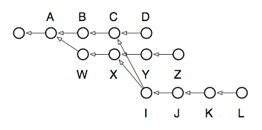

# 交互式变基

当上面运行 rebase 时，它会自动重写从 `W` 到 `Z` 的所有提交，以便将 `Z` 分支重新基于 `D` 提交（即 `D` 分支的头提交）。但是，你可以完全控制如何进行此重写。如果向 `rebase` 提供 `-i` 选项，则会弹出一个编辑缓冲区，你可以在其中选择应该针对本地 `Z` 分支的每个提交要执行的操作：

* **pick** — 这是默认行为，如果你不使用交互模式，则会为分支中的每个提交选择此行为。它意味着应将所讨论的提交应用于其（现在已重写的）父提交。对于涉及冲突的每个提交，`rebase` 命令都会为你提供解决冲突的机会。

* **squash** — 合并的提交将其内容“折叠”到其前面的提交的内容中。这可以多次执行。如果你采用上面的示例分支并合并了所有提交（除了第一个必须是 **pick** 以便 **squash**），则最终会得到一个新的 `Z` 分支，其中仅包含一个提交在 `D` 之上。如果你的更改分布在多个提交中，但希望将历史记录重写为将它们显示为单个提交，则此选项非常有用。

* **edit** — 如果将提交标记为 **edit**，则变基过程将在该提交处停止，并将你留在 shell 中，其中当前的工作树设置为反映该提交。索引将包含所有提交的更改，以便在运行 `commit` 时包含它们。因此，你可以进行任何想要的更改：修改更改，撤消更改等等；在提交后运行 `rebase --continue` 后，提交将被重写，就好像最初就进行了这些更改。

* **(drop)** — 如果从交互式变基文件中删除一个提交，或者将其注释掉，那么该提交将简单地消失，就好像从未进行过检入一样。请注意，如果后续的任何提交依赖于这些更改，则可能会导致合并冲突。

这个命令的强大之处一开始很难理解，但它赋予了你对任何分支形状的几乎无限控制权。你可以使用它来：

* 将多个提交折叠成单个提交。
* 重新排序提交。
* 删除你现在后悔的不正确更改。
* 将分支的基底移动到存储库中的任何其他提交。
* 修改单个提交，以修改长期以来的更改。

此时我建议阅读 `rebase` 的手册页，因为其中包含几个示例，说明了如何释放该工具的真正威力。为了最后再尝试一下这个强大工具，考虑以下情景以及如果有一天你想要将次要分支 `L` 迁移到成为 `Z` 的新头部时会怎么做：



图片中显示：我们有我们的主要开发线 `D`，它三次提交以前分支出来开始 `Z` 的推测开发。在所有这一切中间的某个时候，当 `C` 和 `X` 是它们各自分支的头时，我们决定开始另一项推测，最终产生了 `L`。现在我们发现 `L` 的代码不错，但不够好，无法合并回主要开发线，所以我们决定将这些更改移动到开发分支 `Z`，使其看起来好像我们在一个分支上完成了所有更改。哦，还有，当我们在更改版权日期时忘记了是 2008 年！以下是解开这个混乱的节点所需的命令：

```bash
$ git checkout L
$ git rebase -i Z
```

解决冲突后，我现在拥有了这个存储库：


正如你所看到的，就本地开发而言，变基使你可以无限制地控制提交在存储库中的外观方式。
