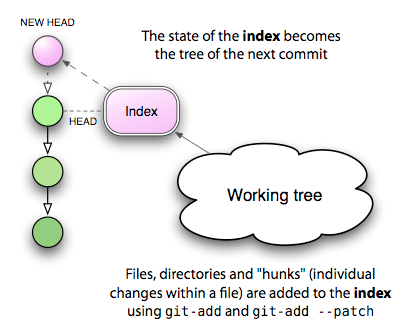

# 索引：遇见中间人

在你的数据文件（存储在文件系统中）和 Git blob（存储在仓库中）之间，有一个有点奇怪的实体：Git 索引。使这个东西难以理解的部分之一是它的名字相当不幸。它是一个索引，因为它指的是通过运行 `add` 创建的一组新创建的树和 blob。这些新对象很快就会被绑定到新树中，以便提交到你的仓库中 - 但在那之前，它们只由索引引用。这意味着如果你使用 `reset` 从索引中注销更改，你最终会得到一个孤立的 blob，在将来的某个时候会被删除。

索引实际上只是你下一个提交的暂存区，它存在的原因是有很好的理由：它支持一种可能对 CVS 或 Subversion 用户来说很陌生，但对 Darcs 用户来说却太熟悉的开发模式：逐步构建你下一个提交的能力。



首先，我要说有一种方法几乎完全忽略索引：通过在提交中传递 `-a` 标志。例如，看看 Subversion 的工作原理。当你输入 `svn status` 时，你将看到一个要应用到你的仓库的下一次 `svn commit` 调用的操作列表。在某种程度上，这个“下一个操作列表”是一种非正式的索引，通过比较你的工作树的状态与 HEAD 的状态来确定。如果文件 `foo.c` 已更改，则在你的下一次提交中，这些更改将被保存。如果一个未知文件旁边有一个问号，它将被忽略；但是使用 `svn add` 添加的新文件将被添加到仓库中。

这与使用 `commit -a` 发生的情况没有什么不同：新的未知文件被忽略，但使用 `add` 添加的新文件以及对现有文件的任何更改都将被添加到仓库中。这种交互与 Subversion 做事情的方式几乎完全相同。

真正的区别在于，在 Subversion 的情况下，你的“下一个操作列表”始终是通过查看当前工作树来确定的。在 Git 中，“下一个操作列表” **就是** 索引的内容，它表示将成为下一个 HEAD 状态的内容，你可以在执行 `commit` 之前直接操纵它。

如果这还不清楚，考虑以下示例：你有一个可靠的源文件 `foo.c`，并且对它进行了两组不相关的更改。你想要做的是将这些更改分成两个不同的提交，每个提交都有自己的描述。以下是在 Subversion 中执行此操作的方法：

```bash
$ svn diff foo.c > foo.patch
$ vi foo.patch
<编辑 foo.patch，保留我想要稍后提交的更改>
$ patch -p1 -R < foo.patch  # 删除第二组更改
$ svn commit -m "第一个提交消息"
$ patch -p1 < foo.patch  # 重新应用剩余的更改
$ svn commit -m "第二个提交消息"
```

听起来很有趣吗？现在为复杂、动态的一组更改重复执行许多次。以下是使用索引的 Git 版本：

```
$ git add --patch foo.c
<选择我想要首先提交的 hunk>
$ git commit -m "第一个提交消息"
$ git add foo.c  # 添加剩余的更改
$ git commit -m "第二个提交消息"
```

而且，这变得更加简单！如果你喜欢 Emacs，Christian Neukirchan 的优秀工具 `gitsum.el` 可以在这个潜在的乏味过程中给出一个漂亮的界面。我最近
