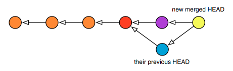

# 执行软重置

如果你使用 `--soft` 选项来执行 `reset`，这与简单地将你的 HEAD 引用更改为不同的提交是相同的。你的工作树更改将保持不变。这意味着以下两个命令是等效的：

```bash
$ git reset --soft HEAD^     # 将 HEAD 备份到其父级，
                             # 实际上是忽略了最后一次提交
$ git update-ref HEAD HEAD^  # 手动执行相同的操作
```

在这两种情况下，你的工作树现在位于一个较旧的 HEAD 之上，因此如果运行 `status`，你应该会看到更多的更改。这并不是你的文件已被更改，只是它们现在正在与一个较旧的版本进行比较。这可以让你有机会创建一个新的提交来替代旧的提交。实际上，如果要更改的提交是最近检入的提交，你可以使用 `commit --amend` 将最新的更改添加到最后一个提交中，就好像你已经一起完成了一样。

但请注意：如果你有下游的消费者，并且他们已经在你之前的 head 上进行了工作 —— 你放弃的那个 head —— 这样改变 HEAD 将会在他们下一次拉取后自动强制进行合并。下面是在执行软重置和新提交后你的树看起来的样子：


以下是在他们再次拉取后你的消费者 HEAD 的样子，使用颜色显示各个提交的匹配情况：


