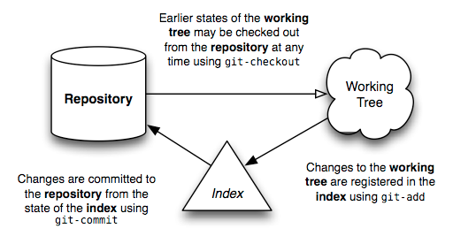

# 绪论

欢迎来到Git的世界。我希望这份文档能够帮助你深入了解这个强大的内容跟踪系统，并揭示一些简单的底层原理——尽管从外部看起来，它的选项似乎令人眼花缭乱。

在我们深入探讨之前，有几个术语应该首先提到，因为它们将在整个文本中反复出现：

* **仓库** — 一个**仓库**是一组 **提交**，每个提交都是项目在过去某个日期的 **工作树** 的归档，无论是在你的计算机上还是在其他人的计算机上。它还定义了 HEAD（见下文），用于标识当前工作树来源的分支或提交。最后，它包含一组 **分支** 和 **标签**，以名称标识特定的提交。

* **索引** — 与你可能使用过的其他类似工具不同，Git 不会直接将 **工作树** 中的更改提交到 **仓库** 中。相反，更改首先被记录在称为 **索引** 的东西中。可以将其视为在执行提交之前逐个“确认”你的更改。有些人发现将其称为“暂存区”而不是索引更有帮助。

* **工作树** — **工作树** 是你的文件系统上的任何目录，其中有一个与之关联的 **仓库**（通常通过其中存在名为 `.git` 的子目录来表示）。它包括该目录中的所有文件和子目录。

* **提交** — **提交** 是在某个时间点对你的工作树的快照。在你进行提交时，HEAD（见下文）的状态成为该提交的父级。这就是所谓的“修订历史”的概念。

* **分支** — 一个 **分支** 只是对一个提交的命名（稍后将会详细介绍提交），也称为引用。提交的父级决定了它的历史，因此也决定了“开发分支”的典型概念。

* **标签** — 一个 **标签** 也是对一个提交的命名，类似于 **分支**，不同之处在于它始终命名相同的提交，并且可以有自己的描述文本。

* **主分支** — 大多数仓库中的主要开发都在一个名为 “**主**” 或 "**main**" 的分支上进行。尽管其中一个通常被约定为默认名称，但所选择的名称和分支本身并没有特殊之处。

* **HEAD** — **HEAD** 被你的仓库用于定义当前检出的内容：
  * 如果你检出一个分支，HEAD 符号地指向该分支，表示在下一次提交操作之后该分支名称应该更新。
  * 如果你检出一个特定的提交，HEAD 只指向该提交。这被称为一个分离的 **HEAD**，例如，如果你检出一个标签名称。

* **远程** — 这是对位于其他地方的相同仓库的不同副本的引用，例如，位于另一台计算机上。**远程** 仓库可能与本地副本处于不同的状态，但应始终共享至少一个共同的祖先提交。本地和远程仓库使用一个公共提交来分别发散，使 `git` 能够实现协作式分布式工作。

事件的典型流程是这样的：创建仓库后，你的工作将在工作树中完成。一旦你的工作达到一个重要点——修复一个错误的完成，工作日结束，一切编译通过的时刻——你将逐个将你的更改添加到索引中。一旦索引包含你打算提交的所有内容，你就将其内容记录在仓库中。下面是显示典型项目生命周期的简单图示：

有了这个基本的概念，接下来的几节将尝试描述这些不同实体对 Git 运作的重要性。

**许可证**：本文档使用 [创作共用 BY 4.0 许可证](https://creativecommons.org/licenses/by/4.0/legalcode)进行许可。如果你想将其翻译成其他语言，请随意，只要你引用了这个原始文本。
