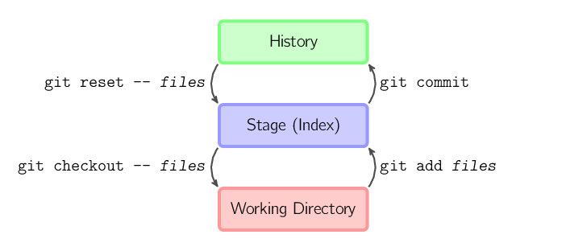
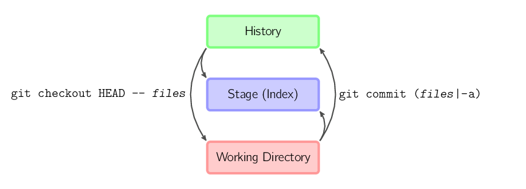

## 基本用法

上面的四条命令在工作目录、暂存目录(也叫做索引)和仓库之间复制文件。

- `git add `*`files`* 把当前文件放入暂存区域。
- `git commit` 给暂存区域生成快照并提交。
- `git reset -- `*`files`*
  用来撤销最后一次`git add `*`files`*，你也可以用`git reset`
  撤销所有暂存区域文件。
- `git checkout -- `*`files`*
  把文件从暂存区域复制到工作目录，用来丢弃本地修改。

你可以用 `git reset -p`, `git checkout -p`, or
`git add -p`进入交互模式。

也可以跳过暂存区域直接从仓库取出文件或者直接提交代码。

- `git commit -a ` 相当于运行 `git add`
  把所有当前目录下的文件加入暂存区域再运行。`git commit`.
- `git commit `*`files`*
  进行一次包含最后一次提交加上工作目录中文件快照的提交。并且文件被添加到暂存区域。
- `git checkout HEAD -- `*`files`* 回滚到复制最后一次提交。
